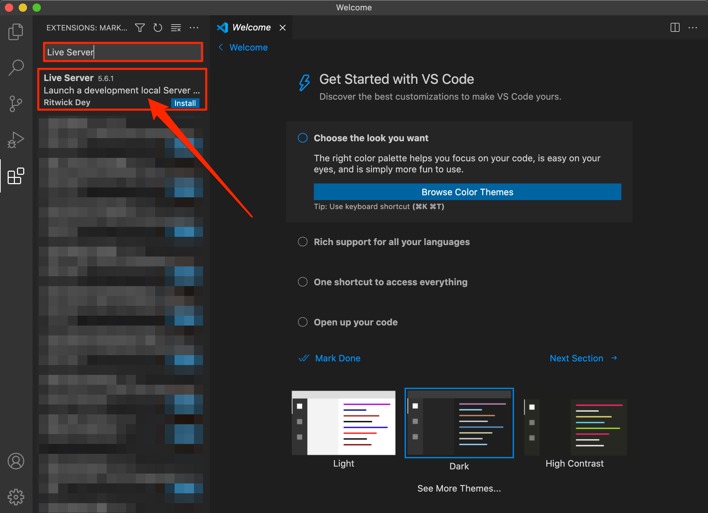
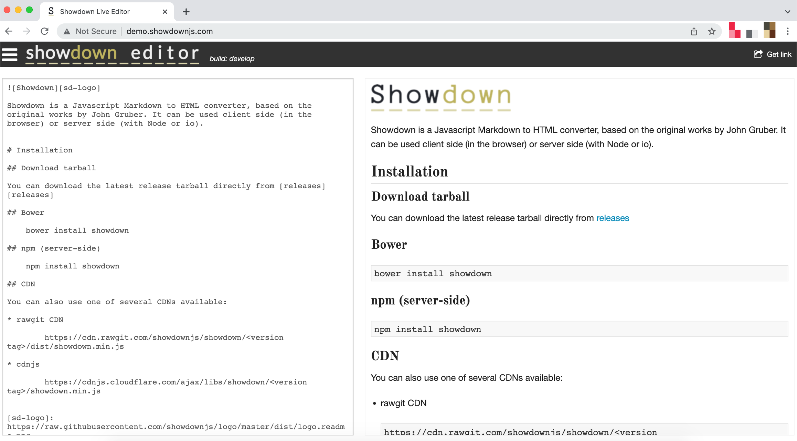
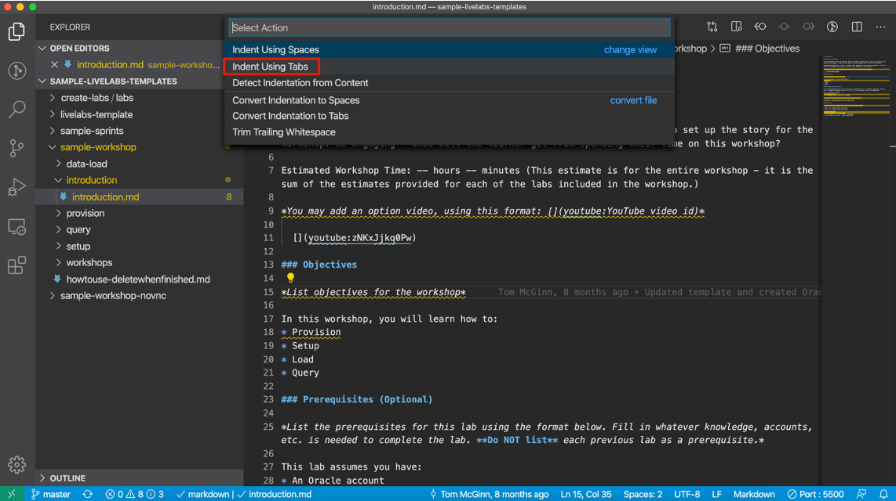
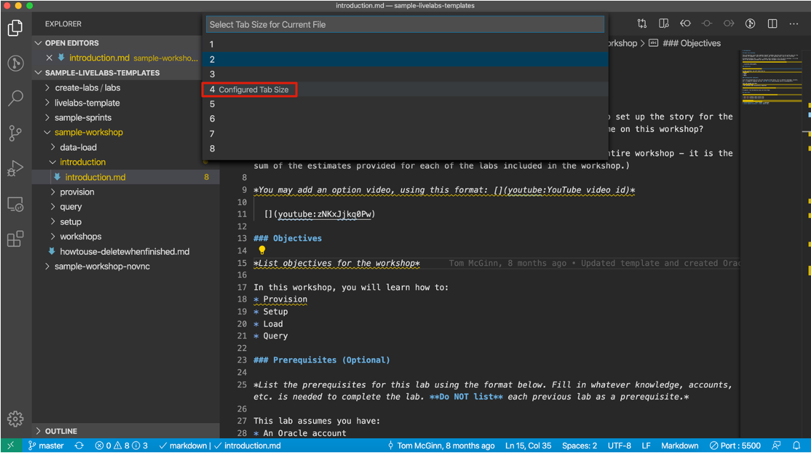
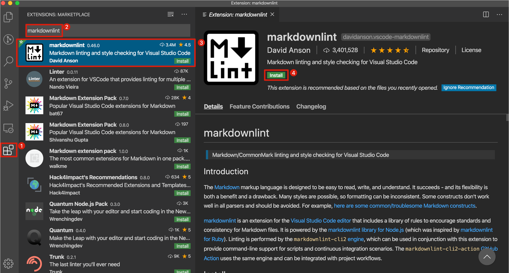

# Set Up GitHub and Install Tools

## Introduction

In this lab, you will learn how to create a GitHub Account and associate it with your email account, set up the GitHub development environment, and install GitHub Desktop, Visual Studio Code (IDE) and its extensions.

### Objectives

* Create a GitHub account and add it to the Oracle GitHub Organization.
* Set up your GitHub environment.
* Install GitHub Desktop Client.
* Install Visual Studio Code (IDE)
* Install Live Server extension in Visual Studio Code
* Optional extension to install in Visual Studio Code

## Task 1: Create and Set Up Your GitHub Account

In this Task, you will create and set up your GitHub account.

1. Create a free GitHub Account here: [GitHub Web UI](https://github.com/) if you don't have one.

    

2.  If this is a new account, use your email ID to register.

    > **Note:** Do not create a secondary new account to join GitHub.

3. Go to [GitHub Settings](https://github.com/settings/profile) and configure the following:
    *   Set your Name.
    *   Add your Profile Picture.

4. Click **Account** to add your user name in the **Enter a user name** dialog. For example, johnhall.

5. We recommend setting a 2 Factor Authentication here: [GitHub Security](https://github.com/settings/security).

## Task 2: Download and Install the latest version of Git (Optional Step)

> **Note:** If you are new to Git and Github, we recommend using the GitHub Desktop client because of its simple and user-friendly user interface. Therefore, skip this task and follow the instructions in **Task 3: Install GitHub Desktop** if you are not familiar with command-line interface.

To install Git:

1. Install Git for your operating system from the [Git download site] (https://git-scm.com/downloads).

2. Click the required option under **Downloads** (**Windows** in this example) and save the installer file.

3. Browse to the downloaded location and double-click the file to launch the installer.

4. Click **Yes** in the **User Account Control** dialog box.

5. Click **Next** in the **GNU General Public License** dialog box.

6. Under **Choose the default behavior of `git pull`**, leave the selected **Default (fast-forward or merge)** option as is and click **Next**.

7. In the **Configuring experimental options** dialog box, click **Install**.

## Task 3: Install GitHub Desktop

The GitHub Desktop application is a UI client for Windows and Mac that simplifies the complex set of GitHub command line arguments. GitHub Desktop is a fast and easy way to contribute to projects and it simplifies your development workflow.

To set up the GitHub Development Environment and install **GitHub Desktop**:

1. Download and install **GitHub Desktop** from [GitHub Desktop](https://desktop.github.com/).

2. When the software is successfully installed, open the **GitHub Desktop**.

  

3. Click **File > Options > Sign in**, enter your GitHub **Username** or **email address**, **Password**, and then click **Sign in**. You will receive an authentication code sent to your cell phone. Enter this code in the **Authentication code** field in the **Sign in** dialog box.

    > **Note:** The authentication code is valid only for a few seconds.

	You are now logged in to **GitHub Desktop**.

  

## Task 4: Install Visual Studio Code as an IDE (optional)

You can use your preferred editor. If you are new to Markdown, we recommend downloading Visual Studio Code to author and edit your Markdown (.md) content. Below, you can find the instructions on how to download and install Visual Studio Code..

To install Visual Studio Code:

1. Visit the [download](https://code.visualstudio.com/download) site and select the zip file for your operating system. In this case, we chose Mac OS.

  

2. Double-click the zip file to expand it. The VS Code application will then show in your downloads folder in Finder.

  

3. Drag it to the Applications folder and double-click it to launch the text editor.

  

## Task 5: Install Live Server Extension for Visual Studio Code (optional)

If you are using Visual Studio Code, you can also instal the *Live Server extension* to view the changes you make to the markdown file dynamically. The extension will start a local web server that enables you not only to preview the transformed markdown but also to experience the look & feel of LiveLabs.

To Install Visual Studio Code's Live Server Extension

1. In the VS Code, navigate to the **Extensions** on the left-side navigation bar.

  

2. Type **Live Server** into the extensions search bar and select the first entry, "Live Server 5.6.1".

  

3. Click **Install**.

  

## Task 6: (Optional) Helpful resources and extensions for Visual Studio Code

1. [Showdown Editor](http://demo.showdownjs.com/) is a Javascript Markdown to HTML converter that LiveLabs uses in the background to convert Markdown files to HTML. This documentation is a helpful resource while developing content in markdown files. This document provides a quick description of the markdown syntax supported on the left side and the output in HTML format on the right side. Showdown Editor shows the syntax of writing, paragraphs, headings, block and italics, code formatting, creating lists, tables, adding links, images, escaping entities, etc.

  

2. Set up tab spacing in Markdown files in Visual Studio Code - To have a fixed indentation and consistency in all the markdown files among the images, code snippets, and between the numbers in each task with the line starting, you need to set spaces to tabs (size 4).

  To set spaces to tabs size 4, click on spaces, choose indent with tabs, and select 4 as configured size, which sets the tab spacing to 4.

    

    

    

    

3. Install Markdownlink Extension in Visual Studio Code - This extension is helpful to check markdown files linting and styling in VS Code. This extension has a library of rules to encourage standards and consistency for markdown files. 

  To install this extension, search for markdownlint in the VS Code marketplace, select the first one and click on Install to install it.

    

4. Install Code Spell Checker Extension in Visual Studio Code - This extension is helpful to check spellings in the files.

  Search for the code spell checker in the VS Code marketplace, select the first one that doesn’t specify any language in the title, which is the English spell checker, and install it.

  

5. Install Delete Trailing Spaces Extension in Visual Studio Code - Trailing space is all whitespace(s) located at the end of a line, without any other characters following it. This extension is helpful to resolve code blocks, copy and paste issues, and sometimes merge conflicts.

  To highlight trailing spaces, in the VS Code marketplace, search for trailing spaces and select the first trailing spaces, not the one with a fork, and click on Install. Once the extension is installed, you can see that whitespace(s) are highlighted in red to delete them.

  

6. Install Path Intellisense Extension in Visual Studio Code - since repositories in the Oracle LiveLabs GitHub project have many files, you may want to access files in different folders of your workshop or sometimes in a different directory. To know the file, you are pointing to in the manifest.json file, you can use the path intellisense extension.

  To install this extension, search for path intellisense in VS Code marketplace, select the first extension and install it.

  

  Use Path Intellisense Extension in manifest.json file - After typing the backslash, hit enter to view or choose the folder(s) or file(s)

  

  

This concludes this lab. You may now **proceed to the next lab**.

## Learn More

* [Download and Install Git for Windows](https://git-scm.com/download/win)
* [Download and Install Git for Mac](https://git-scm.com/download/mac)

## Acknowledgements

* **Author** - Anoosha Pilli, Product Manager, Database Product Management
* **Last Updated By/Date:** Anoosha Pilli, September 2022