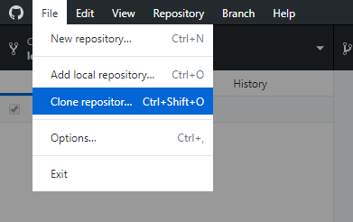
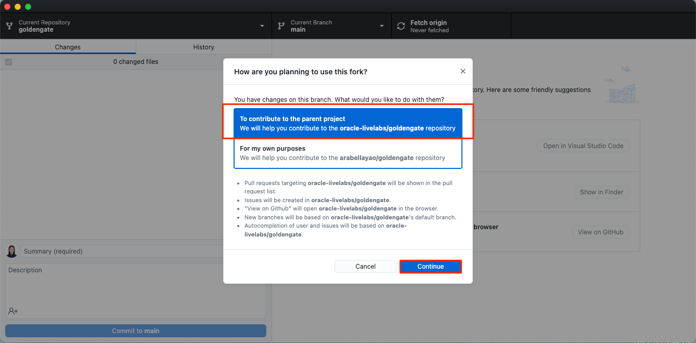
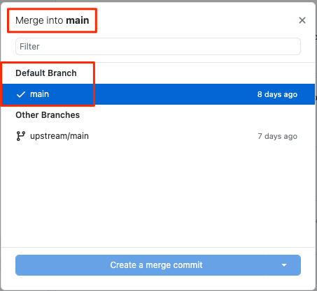
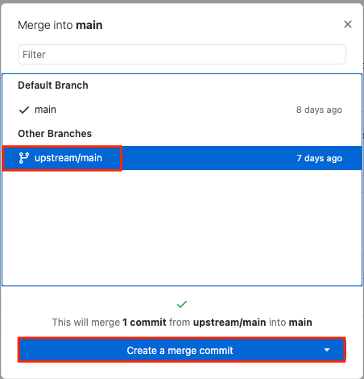

# Stay in Sync with GitHub Environment

## Introduction

Oracle LiveLabs has a set folder structure that you will need to follow for developing your workshops. The folder structure is only part of the development since the workshop content is contained in the Markdown files and images that you write and edit as your workshop development. You can use your preferred editor to author and edit your Markdown (.md) content for rendering the Workshop output.

> **Note:** Oracle recommends using **Visual Studio Code (VSCode)**.

### Objectives

* Clone and fork Oracle LiveLabs GitHub repositories.
* Understand the **Oracle LiveLabs** folder structure.
* Familiarize yourself with the components of the workshop and the lab folders.
* Learn about the tools that are available to develop and host your content.
* Learn how to merge content.

## Task 1: Fork Repositories of the oracle-livelabs Project on Your GitHub Account

After your workshop is approved by the council group, you will be creating your workshop and labs in the [oracle-livelabs/partner-solutions](https://github.com/oracle-livelabs/partner-solutions) repository of the **oracle-livelabs** project. You must fork the repository to create a duplicate personal copy of the repository on your GitHub account. You own the forked (stage) repository, and you can edit its contents without affecting the parent (production) repository.

For example, if a user named **anooshapilli** forks the [oracle-livelabs/partner-solutions](https://github.com/oracle-livelabs/partner-solutions) repository in the **oracle-livelabs** project, a duplicate repository [anooshapilli/partner-solutions](https://github.com/anooshapilli/partner-solutions) is created.

To create a workshop in the [oracle-livelabs/partner-solutions](https://github.com/oracle-livelabs/partner-solutions) repository, you need to fork the **partner-solutions** repository. The following steps walk you through forking the **partner-solutions** repository, in the oracle-livelabs GitHub project.

1. Log in to the [GitHub Web UI](http://github.com), using your GitHub account.

2. Navigate to the [oracle-livelabs/partner-solutions](https://github.com/oracle-livelabs/partner-solutions) repository.

3. Click **Fork**.

	In this example, we are forking the goldengate repository but the following process is the same for forking your **partner-solutions** repository.

  

4. Under **Owner**, expand the dropdown list and select your username. You can accept the **Repository name** as it is. Click **Create fork**.

  

5. Then, your user has forked the **partner-solutions** repository.

	As you can see, arabellayao user has forked the goldengate repository.

  

In the next task, you will clone this forked repository.

## Task 2: Clone the Forked Repository

A clone is a copy of your forked repository that lives on your local computer instead of on [GitHub Web UI](http://github.com). When you clone your forked repository, you can edit the files in your preferred editor, such as **Atom** editor, or **Visual Studio Code**, and use the **GitHub Desktop** client to keep track of your changes without having to be online.

> **Note:** Make sure you are performing the following steps **off VPN**. When performing clones and fetching origin you should not be on VPN, but editing and other steps such as pull request it does not matter.

To clone the forked **partner-solutions** repository:

1. Open your **GitHub Desktop** application and log in using your GitHub account.

2. Click **File > Clone repository** to display the **Clone a Repository** dialog box.

    

3. Select your repository such as **your account/repo** from **Your Repositories**.  Under **Local Path**, select the local path on your machine where the repository is going to be cloned (copied). This is where the repository files get copied to your local file system. Click **Clone**.

	In this example, arabellayao/goldengate is selected.

    

4. The cloning process may take several minutes, depending on how big the repository is.

  

5. When asked how you plan to use the fork, select **To contribute to the parent project**. Click **Continue**.

  

6. The repository files will appear in the local path you just specified. You can now start working on your labs and workshops!

	In this case, it is goldengate.

  

	Once you make a clone, you can create your project folder, edit the files in your preferred editor, such as **Atom** or **Visual Studio Code**, and use **GitHub Desktop** to keep track of your changes without having to be online.

	> **Note:** The repository you cloned (local version) is connected to the your fork (remote version) so that you can push your local changes to the remote to keep them synced when you are online.

7. You can also use Github Desktop to synchronize the changes that you have made in your local file system to the forked content on your GitHub repo. More details on using Github Desktop in Lab 4 of this workshop.

  

## Task 3: Merge Content from Git Before You Start Editing Your Content

Every day before you start editing your content, ensure to do a merge from upstream. You can do that using your `git` on the command line or GitHub Desktop. Merging synchronizes the content in your cloned repository with the latest content on the **upstream/main** repository and ensures that you have the most recent versions of the templates and other workshops/labs.

**Please note:** We provide documentation only on using Github Desktop. If you are familiar with Git, you can use Git also on the command line.

> **Note**: If you do not do that, you may get merge conflicts later when you commit your changes, which can be complex to fix.

To merge content using Github Desktop:

1. Start your **GitHub Desktop** client.

2. If you have multiple repositories, first switch to the repository that you will work on. Expand the dropdown list of **Current Repository**. Click the **partner-solutions** repository to sync.

	In this example, we are selecting the em-omc repository, but the following process is the same for syncing your repository.

  

3. Make sure you perform the following steps **off VPN**. Otherwise, your GitHub Desktop may be stuck.

4. Click **Fetch origin**.

  

5. Select **Branch > Merge into Current Branch...** to display the **Merge into main** window.

    

6. Under the **Default Branch**, the main branch is selected by default. This indicates the local clone on your PC.

    

7. Scroll down the **Merge into main** window, select **upstream/main** (this is your production repository which is oracle-livelabs/partner-solutions repository), and then click **Create a merge commit**. In this example, this will create 1 merge commit with the changes you fetched and merged from the **upstream/main** into the clone on the local PC.

    When the merge is completed, a **"Successfully merged upstream/main into main"** message is displayed.

    

8.  To push the new commits from the local clone to your forked location, click **Push origin**.

    > **Note:** If you get an *Authentication failed* error, refer to the Lab 6 - GitHub FAQ.

    

9.	To determine if your clone is up-to-date with **upstream/main** (production), repeat Steps 4 to 7. If both repositories are synchronized, then the following message is displayed: **This branch is up to date with upstream/main**.

    

  In the **GitHub Desktop** UI, notice that the **Push origin** is replaced by **Fetch origin** after the push origin operation is completed.  The local clone and fork repositories are now synchronized with the main repository.

  

## Task 4: Commit your Changes in your Clone

When you create, delete, or modify assets in your clone (local copy), you should commit (save) those changes to your clone, and then push those changes from your clone to your fork. Then these changes get saved to your forked repository.

To commit your changes:

1. Start your **GitHub Desktop** client.

2. In the **Summary (required)** text box on the left (next to your profile picture), enter a summary of your changes. You can optionally add a more detailed description of your changes in the **Description** text box.

  

3. Click **Commit to main**. This saves your changes in your local clone. **Fetch origin** changes to **Push origin**.

4. Click **Push origin** (it should have an upward arrow with a number). This pushes the updated content from your clone into the origin of this clone, that is, your fork.

  

## Task 5: Set Up GitHub Pages for your Fork to Test your Content

The GitHub Web UI has a feature called **Set Up GitHub Pages for Your Fork** to test your content. This feature performs a dynamic conversion of the Markdown files (.md files you have developed using your Atom Editor) to HTML. After you upload the content from your clone to your fork, you can preview your workshop and labs on your forked repository with **your GitHub Pages site URL** (or the URL of your forked repository). You can also provide this URL with your workshop team members and the Oracle LiveLabs council team members to review this content.

> **Note:** You should perform the following actions in your forked GitHub repository (e.g. [https://github.com/anooshapilli/partner-solutions](https://github.com/anooshapilli/partner-solutions)), instead of the production repository (e.g. [https://github.com/oracle-livelabs/partner-solutions](https://github.com/oracle-livelabs/partner-solutions)).

To publish your GitHub Pages site:

1. Log in to [GitHub Web UI](http://github.com) using your GitHub account credentials.

2. Click your **partner-solutions** fork link in the **Repositories** section to open your fork.

  Here we are using the em-omc repository as an example, but the following process is the same for your **partner-solutions** repository.

  

3. Click **Settings** in your **partner-solutions** fork.

   

4. On the left menu, click **Pages**.

  

5. Under **Source**, select **main** (if it's not already selected) from the drop-down list and click **Save**.

  

6. Optional: Under **Theme Chooser**, click **Change Theme** and select a theme of your choice.

7. This may take a few minutes to complete. After the GitHub Pages are enabled, the message under **GitHub Pages** changes and provides the link to your user account GitHub Pages site for the **partner-solutions** repo.

	In this example, it displayed the message with GitHub Pages site URL for the arabellayao user account and em-omc repo - **Your site  is published at https://arabellayao.github.io/em-omc/**

  

8.	Save your Github Pages site link for later use.

## Task 6: Access your Workshop on GitHub

After your have successfully set up your GitHub pages, wait a few minutes and perform the steps below. Github pages take approximately 5 minutes for the pages to be copied.

1. This workshop for example is located in the link below.

    ```
   https://github.com/arabellayao/em-omc/blob/main/enterprise-manager/emcc/workshops/freetier/index.html
    ```

3. The published version becomes:

    ```
    https://arabellayao.github.io/em-omc/enterprise-manager/emcc/workshops/freetier/index.html
    ```

> **Note:** If there are any concerns or issues while syncing your GitHub environment, check out the steps to resolve the issues in the GitHub FAQ lab on the left menu.

This concludes this lab. You may now **proceed to the next lab**.

## Acknowledgements

* **Author** - Anoosha Pilli, Product Manager, Database Product Management
* **Last Updated By/Date:** Anoosha Pilli, September 2022