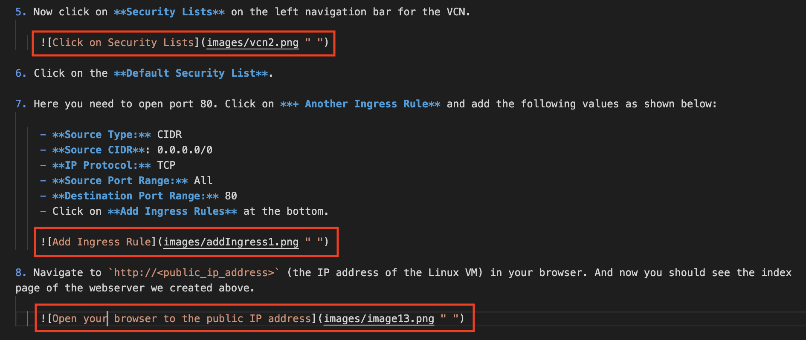
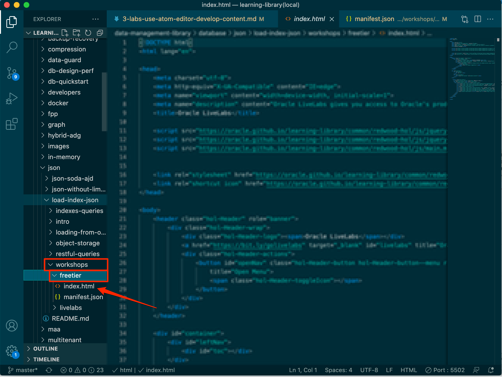
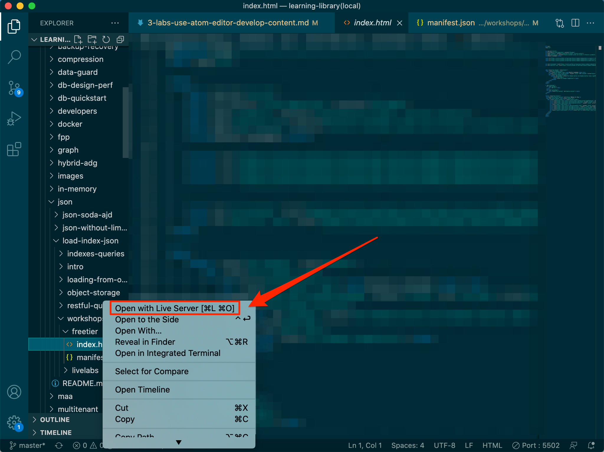

# Use A Text Editor to Develop Markdown Content

## Introduction

Oracle LiveLabs has a set folder structure that you will need to follow for developing your workshops. The folder structure is only part of the development since the workshop content is contained in the Markdown files and images that you write and edit as your workshop development. You can use your preferred editor to author and edit your Markdown (.md) content for rendering the Workshop output.
If you are new to Git and Github, we recommned using Github Desktop to maintain your repository.
**Of course, you can use any IDE or Git tool of your choice**

### Objectives

* Install Visual Studio Code and Github Desktop to 
* Clone and fork Oracle LiveLabs GitHub repositories.
* Familiarize yourself with the components of the workshop and the lab folders.
* Learn about the tools that are available to develop and host your content.
* Learn how to merge content.

## Task 1: Install Visual Studio Code as an IDE (optional)

You can use your preferred editor.
If you are new to Markdown, we recommend downloading Visual Studio Code to author and edit your Markdown (.md) content. Below, you can find the instructions on how to download and install Visual Studio Code..

### Install Visual Studio Code**

To install Visual Studio Code:

1. Visit the [download](https://code.visualstudio.com/download) site and select the zip file for your operating system. In this case, we chose Mac OS.

  

2. Double-click the zip file to expand it. The VS Code application will then show in your downloads folder in Finder.

  

3. Drag it to the Applications folder and double-click it to launch the text editor.

  

## Task 2: Install Live Server Extension for Visual Studio Code (optional) 

If you are using Visual Studio Code, you can also instal the *Live Server extension* to view the changes you make to the markdown file dynamically. The extension will start a local web server that enables you not only to preview the transformed markdown but also to experience the look & feel of LiveLabs.

### Install Visual Studio Code's Live Server Extension**

1. In the VS Code, navigate to the **Extensions** on the left-side navigation bar.

  

2. Type **Live Server** into the extensions search bar and select the first entry, "Live Server 5.6.1".

  

3. Click **Install**.

  

## Task 3: Merge Content from Git Before You Start Editing Your Content

Every day before you start editing your content, ensure to do a merge from upstream.
You can do that using your `git` on the command line or GitHub Desktop.

**Please note:** We provide documentation only on using Github Desktop. If you are familiar with Git, you can use Git also on the command line.

Merging synchronizes the content in your cloned repository with the latest content on the **upstream/main** repository and ensures that you have the most recent versions of the templates and other workshops/labs.

> **Note**: If you do not do that, you may get merge conflicts later when you commit your changes, which can be complex to fix.

To merge content using Github Desktop:

1. Start your **GitHub Desktop** client.

2. If you have multiple repositories, first switch to the repository that you will work on. Expand the dropdown list of **Current Repository**. Click the **partner-solutions** repository to sync.

	In this example, we are selecting the em-omc repository, but the following process is the same for syncing your repository.

  

3. Make sure you perform the following steps **off VPN**. Otherwise, your GitHub Desktop may be stuck.

4. Click **Fetch origin**.

  

5. Select **Branch > Merge into Current Branch...** to display the **Merge into main** window.

    

6. Under the **Default Branch**, the main branch is selected by default. This indicates the local clone on your PC.

    

7. Scroll down the **Merge into main** window, select **upstream/main** (this is your production repository which is oracle-livelabs/partner-solutions repository), and then click **Create a merge commit**. In this example, this will create 1 merge commit with the changes you fetched and merged from the **upstream/main** into the clone on the local PC.

    When the merge is completed, a **"Successfully merged upstream/main into main"** message is displayed.

    

8.  To push the new commits from the local clone to your forked location, click **Push origin**.

    > **Note:** If you get an *Authentication failed* error, refer to the Lab 6 - GitHub FAQ.

    

9.	To determine if your clone is up-to-date with **upstream/main** (production), repeat Steps 4 to 7. If both repositories are synchronized, then the following message is displayed: **This branch is up to date with upstream/main**.

    

  In the **GitHub Desktop** UI, notice that the **Push origin** is replaced by **Fetch origin** after the push origin operation is completed.  The local clone and fork repositories are now synchronized with the main repository.

  

## Task 4: Create Your Labs and Workshop Content

Leverage the content from the **sample-livelabs-templates/sample-workshop** folder to start creating lab and workshop content for your project.

> **Note:** Make sure to update your clone from the **upstream/main** repository (detailed in **Task 3** of this lab) regularly whenever you are working on the markdown files.

To create your lab and workshop content:

1. Make sure you have submitted your workshop request (see details in Lab 1 -> Task 1) to [livelabs-help-community_us@oracle.com]( livelabs-help-community_us@oracle.com) **BEFORE** you begin development.  *No GitHub requests will be approved without the approved workshop ID.*

2. Open your cloned repository using Windows Explorer (Windows) or Finder (Mac).

3. Create your project folder with a name on the parent level in your cloned repository.

4. Go to **sample-livelabs-templates/sample-workshop**. This has a few lab folders, such as **provision**, **query**, etc. Every lab folder contains the following: a **files** folder, an **images** folder, and the respective `.md` file. If you open this folder in your editor, you can use **Live Server** (steps in task 6 of this lab) to open up **sample-workshop/workshops/tenancy/index.html** to see how a workshop will show up in production, and play with it.

5. Copy any lab folder (except the folder named `workshops`), such as the **query** folder, to your project folder. In your project folder, rename the folder **query** and its respective `.md` file within it as per your requirement. Based on the sample **query** folder, you can create and rename as many labs (folders) and the respective `.md` files as per your requirement.

    > **Note:** The **files** folder within every sample lab folder is currently not required and is reserved for future use. You can remove it if you do not need it.

    

    After you copy the sample folder to your project folder, if you delete your copy of the **files** folder from your project folder, your lab folder will look similar to this example:

	

6.	To add an introduction to your workshop, then navigate to **sample-livelabs-templates/sample-workshop** folder and copy the `introduction` folder to your project folder. You can rename the introduction folder if you would want to.

7. Similarly, navigate to the **sample-livelabs-templates/sample-workshop** folder and copy the entire **workshops** folder along with its contents from **sample-livelabs-templates/sample-workshop** to your project folder.

8. To edit the `.md` file of your lab, open your text editor (in this case, we are using Atom), click **File > Open Folder** to display the **Open Folder** dialog box. In VS Code, you would click **File > Open**. Navigate to cloned project folder and select your project folder to open in the editor.

  

9.	The project folder along with the **labs** and **workshops** folder will be displayed in your text editor. In this example, **sample-livelabs-templates/create-labs/labs** folder is opened.

    

10. Select the `.md` file you want to edit, for example, select the `1-labs-git-hub-get-started-install-configure.md` file and edit your lab content. Similarly, edit the `.md` files of the rest of your labs.

    

11. If you want to add images in your lab, then include them within the **images** folder. You can insert images in the respective `.md` file.

12. Similarly, to edit your workshop content, expand the **workshops/tenancy** (if you are creating a workshop running on users' tenancies), **workshops/sandbox** (if you are creating a sandbox/green button workshop), and/or **workshops/desktop** (if you are creating a noVNC workshop) folder in your text editor. Edit the `manifest.json` to list the labs you have added to your workshop (or plan to add) and update the title of the workshop. The `manifest.json` is like your book map file in SDL.

	Besides the list of labs, also update the `workshoptitle` field, and update the `help` field to point to the `livelabs-help-community_us@oracle.com` email. If the `include` and `variables` field do not apply to your workshop, please remove them, otherwise, your workshop will not render properly.

	

13. You can also create a `README.md` file within **workshops/freetier**, and update the `README.md` with a summary of your workshop. Note that the `README.md` file is optional for your workshop.

## Task 5: Security

1. Blur all personal information (IP addresses, intranet URLs, email addresses, OCIDs, usernames, and passwords) from images.

  

2. Every image must have a description: ![DESC] (…/…/name.png “ “)

  

3. Do not use any IP addresses, intranet URLs (for example links to a Confluence page), email addresses, OCIDs, usernames, or passwords in the text. Do not provide a demo password.

## Task 6: Preview Your Workshop and Labs Using Live Server

### Using Visual Studio Code**

1. Within the directory of any workshop you want to view, click the **workshops** folder and then click the **freetier** folder.

  

2. Right-click on the index.html file and select **Open with Live Server**.

  

3. The local version of your workshop will then be launched in your web browser.

> **Note:** If your workshop or labs do not show up using Live Server and you see a blank page, check the manifest.json file.
1. Expand the navigation menu on the left, if you can navigate to other labs, then the problem is with a particular lab. Find that lab's location in the manifest.json file and fix the path to that lab's file.
2. If no labs are showing up, then it is possibly the issue with the workshop. In the manifest.json file, make sure you remove the *include* and *variables* if they do not apply to your workshop.

## Task 7: (Optional) Helpful resources and extensions for Visual Studio Code

1. [Showdown Editor](http://demo.showdownjs.com/) is a Javascript Markdown to HTML converter that LiveLabs uses in the background to convert Markdown files to HTML. This documentation is a helpful resource while developing content in markdown files. This document provides a quick description of the markdown syntax supported on the left side and the output in HTML format on the right side. Showdown Editor shows the syntax of writing, paragraphs, headings, block and italics, code formatting, creating lists, tables, adding links, images, escaping entities, etc.

  

2. Set up tab spacing in Markdown files in Visual Studio Code - To have a fixed indentation and consistency in all the markdown files among the images, code snippets, and between the numbers in each task with the line starting, you need to set spaces to tabs (size 4).

  To set spaces to tabs size 4, click on spaces, choose indent with tabs, and select 4 as configured size, which sets the tab spacing to 4.

    

    

    

    

3. Install Markdownlink Extension in Visual Studio Code - This extension is helpful to check markdown files linting and styling in VS Code. This extension has a library of rules to encourage standards and consistency for markdown files. 

  To install this extension, search for markdownlint in the VS Code marketplace, select the first one and click on Install to install it.

    

4. Install Code Spell Checker Extension in Visual Studio Code - This extension is helpful to check spellings in the files.

  Search for the code spell checker in the VS Code marketplace, select the first one that doesn’t specify any language in the title, which is the English spell checker, and install it.

  

5. Install Delete Trailing Spaces Extension in Visual Studio Code - Trailing space is all whitespace(s) located at the end of a line, without any other characters following it. This extension is helpful to resolve code blocks, copy and paste issues, and sometimes merge conflicts.

  To highlight trailing spaces, in the VS Code marketplace, search for trailing spaces and select the first trailing spaces, not the one with a fork, and click on Install. Once the extension is installed, you can see that whitespace(s) are highlighted in red to delete them.

  

6. Install Path Intellisense Extension in Visual Studio Code - since repositories in the Oracle LiveLabs GitHub project have many files, you may want to access files in different folders of your workshop or sometimes in a different directory. To know the file, you are pointing to in the manifest.json file, you can use the path intellisense extension.

  To install this extension, search for path intellisense in VS Code marketplace, select the first extension and install it.

  

  Use Path Intellisense Extension in manifest.json file - After typing the backslash, hit enter to view or choose the folder(s) or file(s)

  

  

This concludes this lab. You may now **proceed to the next lab**.

## Want to Learn More?

* [Download and Install Git for Windows](https://git-scm.com/download/win)
* [Download and Install Git for Mac](https://git-scm.com/download/mac)
* [Download Visual Studio Code](https://code.visualstudio.com/download)

## Acknowledgements

* **Author** - Anoosha Pilli, Product Manager, Database Product Management
* **Last Updated By/Date:** Anoosha Pilli, July 2022