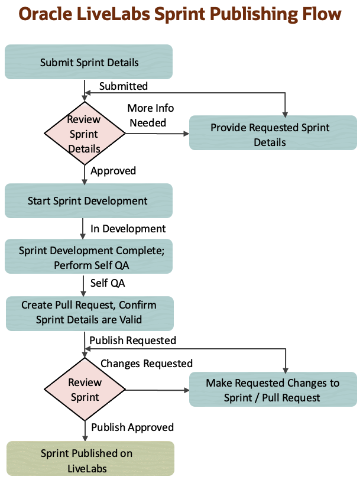
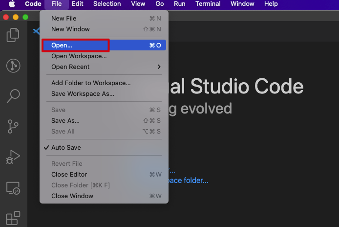
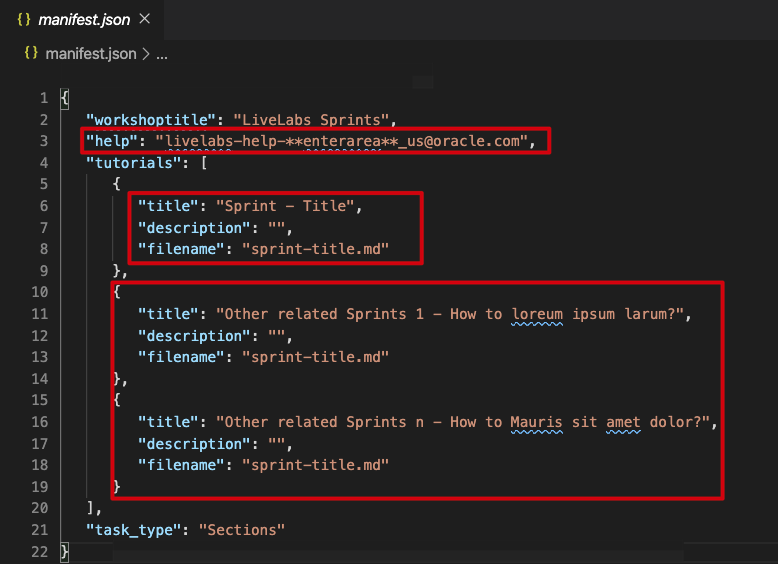

# Develop LiveLabs Sprints

## Introduction

This lab walks you through the steps to create your Sprint in **partner-solutions** repository in Oracle LiveLabs GitHub Project, provides an overview of Sprints Folder Structure, and uses the folder components to develop sprints content. Then shows you how to commit your changes to your clone, create a pull request and submit a new sprint publish request.

> **Note:** For any questions related to LiveLabs Sprints or about the process of the Sprints development lifecycle, send details in an email to **livelabs-help-community_us@oracle.com**. The LiveLabs Admin team will respond in 1-2 business days.

### What are Oracle LiveLabs Sprints?

The scope for LiveLabs Sprint differs from a standard LiveLabs workshop. A LiveLabs Sprint provides users with a quick & easy form of help by providing answers to a particular technical question, challenge, or issue. The maximum duration to complete the steps in a sprint should be less than 10-15 minutes.

The following diagram shows the general LiveLabs Sprint Development Workflow process you need to follow to develop sprint and submit a new sprint publish request.

### Objectives

* Understand the Oracle LiveLabs Sprints Folder Structure and its components
* Create content for your Sprint
* Commit Your Changes to Your Clone and Create Pull Request
* Request Sprint Publish in WMS

### What Do You Need?

To get started with Oracle LiveLabs Sprints development, you should have:

* A GitHub Account (steps in Lab 1 Task 2)
* Installed GitHub Desktop on your machine (steps in Lab 1 Task 4)
* Set up Oracle LiveLabs partner-solutions GitHub Repository (steps in Lab 1 Task 4, 5)
* Installed Visual Studio Code editor (steps in Lab 3 Task 1 Option 2) with LiveServer extension (steps in Lab 3 Task 2 Option 2)

## Task 1: Submit a Sprint Request to the Oracle LiveLabs

> **Note:** Before submitting a new sprint request, check if there is a sprint with the same content in [Oracle LiveLabs](https://developer.oracle.com/livelabs). Please proceed if there is no sprint with the content you want to create.

1. Before you get started, you should submit your new LiveLabs Sprint request by emailing the below required details to [livelabs-help-community_us@oracle.com](livelabs-help-community_us@oracle.com) for the Oracle LiveLabs team to review. Submitting a sprint informs the Oracle ecosystem that you are working on a sprint and submits your idea to the LiveLabs Council. We urge you not to delay this step. There are hundreds of sprints already, this step is important to help us preserve the quality and integrity of the sprint catalog. Failure to provide all the details will prevent your workshop from being approved.

	-	*Sprint Title:* Choose a descriptive title of up to 200 characters. Do not include the word "Sprint" or "Lab" and use "Oracle Speak". Choose a title that users would recognize or understand. Do not use abbreviations ("Autonomous Database" not "ADB") and start the title with an imperative verb ("Build" not "Building").
    -	*Short Description:* The short description is the key piece of information that goes on the tile of the sprint. Keep it crisp, catchy, and interesting. The length is up to 400 characters.
    -   *Sprint Duration:* The duration it takes to complete all the steps in a sprint. The recommended sprint duration should be less than 10-15 minutes.
	- Sprint Owner: Owner and primary Contact of Sprint. This person will develop sprint content, move it to Github and perform self-QA. Responsible for sprint content being correct, accurate, and up-to-date, and will answer customers' questions related to this sprint.
    -	*Focus*: What is the focus of this sprint? For example, Database, AI/ML, Low Code, etc.
	-	*Product*: What are the products demonstrated in this sprint? For example, Blockchain, Data Safe, Autonomous JSON Database, etc.
    -	*Anticipated Completion Date:* When do you anticipate this sprint to be completed?

2. Once you mail us the Sprint details, the sprint will be in **Submitted** status.

3. We recommend you do not start working on your Sprint until the LiveLabs council has approved your Sprint. Once your sprint is submitted, it will be sent to the LiveLabs council for review. The LiveLabs council will approve your sprint and update the status to **Approved** or ask for more details within 1-2 business days through email and update the status to **More Info Needed**. If you have not heard back from your council group after 3 business days, please email them to [livelabs-help-community_us@oracle.com](livelabs-help-community_us@oracle.com). Once approved, you will be entered into the workflow and can start progressing with the development of your sprint.

## Task 2: Understand the Oracle LiveLabs Sprints Folder Structure and its Components

> **Note:** In your cloned partner-solutions repository, inside the sprints directory, you will create your sprint folder anywhere within the domain folder. See the different domain folders and decide on a folder for your sprint. If no existing folder fits your sprint, please contact the LiveLabs team to create a new folder with the folder name by emailing us to [livelabs-help-community_us@oracle.com](livelabs-help-community_us@oracle.com).

1.  The following image shows the folder structure of the sample **sprint** that is opened in the Visual Studio Code Editor. In the **oracle-livelabs/partner-solutions** repository of Oracle LiveLabs GitHub Project, inside **sample-livelabs-templates** folder there is a **sample-sprints** folder. You can see this structure at the following URL https://github.com/oracle-livelabs/partner-solutions/tree/main/sample-livelabs-templates/sample-sprints. You can get started with sprint development by copying this **sprint** folder which is inside the sample-livelabs-templates/sample-sprints folder.

    

2.  The following describes the components of the above example:
    * The root folder of this example is the name of the sprint, **sprint**.
    * Each sprint has its own
        * an **images** folder that contains the screenshots used in this sprint.
        * a **.md** file that contains this sprint's content.
        * an **index.html** file, which is executed when a browser accesses it. When you copy this file from the *sample-sprints* folder, you can use it without changes.
        * a **manifest.json** file, which defines the structure of the sprint that the `index.html` file renders. When you copy this file from *sample-sprints* folder, you can need to customize it for your sprint.

3.  The following screenshot shows a sample `manifest.json` file that is opened in the **Visual Studio Code** Editor.

    > **Note:** Make sure that the **livelabs-help-community_us@oracle.com** email is listed in ***help***.

    

## Task 3: Create Content for your Sprint and Perform Self QA

At this stage your sprint status is **In Development**.

1.  Every day before you start editing your content, make sure to do a Merge in GitHub Desktop (steps in Lab 3 Task 3). Merging synchronizes the content in your cloned repository with the latest content on the upstream/main repository, and it ensures that you have the most recent versions of the templates and other workshops/labs.

2.  Open the **partner-solutions** folder and navigate to the **sample-livelabs-templates/sample-sprints** folder. Copy the **sprint** folder and all the files inside it into the domain folder you decided in the **sprints** directory (partner-solutions/sprints/domain-folder) or copy from an existing Sprint in that domain folder to create your content.

    

3.  Re-name your sprint folder name and the markdown (.md) file to match the folder name.

4.  To edit the .md file of your sprint, open the text editor of your choice. In this case, we use VS Code, click File > Open.

    

5.  Navigate to your sprint folder and click Open to open your sprint folder. Your sprint folder along with the images folder, markdown, index.html and manifest.json files will then be displayed in your text editor.

    

6.  If you want to add images to your sprint, include them in the images folder. You can delete the images folder if you do not need it.

7.  Edit the manifest.json file.
    -   help: Update the field to point to *livelabs-help-community_us@oracle.com* email.
    -   title: Update the first title field with the title of your sprint.
    -   description: Add a short description of the sprint
    -   filename: Update this field with your file name
    -   Other related sprints: The manifest.json is like your book map file in SDL. If you want to add related sprints, update the title fields with the respective sprints tile, description and absolute paths (steps in Lab 3 Task 1) to their markdown files in the filename. You can add up to six related sprints and delete the existing sprints sections if you do not need them.

        

8.  You can take the help of the formatting in .md file you copied earlier and edit it to develop your sprint.

9.  Make sure you develop the content considering all the security related points mentioned in Lab 3 Task 5 of the LiveLabs guide.

10. Preview your Sprint using the Live Server (Steps in Lab 3 Task 6 Option 2).

11. You can refer the Lab 3a for common markdown features for content development and Lab 3 Task 7 for helpful resources and extensions for VS Code.

12. After you have completed developing your Sprint, you need to perform Self-QA of the Sprint to align with the LiveLabs standards. Download this [Self-QA document](https://objectstorage.us-ashburn-1.oraclecloud.com/p/O1GlvQI4x2UHQsLkB2pOEEuARBTJsjrVZ7XNOtGre_U6xvEecj5rW1lItRhKOoBq/n/id05dmgeno0f/b/partner-solutions/o/Sprints-Self-QA.docx) to perform Self QA and check your Sprint against the form, make changes to your changes to your Sprint as needed, and fill out the form. At this point you are in **Self-QA** status.

## Task 4: Commit Your Changes to Your Clone and Create Pull Request

You will push the updated content from your clone into the origin of your clone, that is, your fork, to synchronize your clone with your fork. Again as a reminder, it is a best practice to merge your repository every day or whenever you start your GitHub Desktop application. Merge pulls all the commits (changes) from the upstream/main repositories (Production), into your local filesystem clone (local machine). This keeps your local clone up-to-date with other people's work (commits) from the upstream/main. Next, Merging also avoids the long time it could take to complete if you do not do that often.

1.  Once you have completed the development of the sprint or when you create, delete, or modify assets in your clone (local copy), you should commit (save) those changes to your clone and then push those changes from your clone to your fork (Steps in Lab 4 Task 2). Then these changes get saved to your forked repository.

2.  Before you create a pull request, get the latest updates from the production repository into your clone (Steps in Lab 4 Task 1).

3. Set up GitHub Pages for your Fork (Steps in Lab 4 Task 3) to test or review your Sprint content (Steps in Lab 4 Task 4).

4. Create a Pull Request to upload your content to the main repository, i.e., **https://github.com/oracle-livelabs/partner-solutions** (Steps in Lab 4 task 5).

5. Once the Pull Request is approved, it takes a few minutes for the changes to reflect on the **oracle-livelabs.github.io/partner-solutions** GitHub pages site. You can access your Sprint on GitHub by following the steps in Lab 4 Task 6.

##  Task 5: Submit Sprint Publish Request

1.  After you submit the pull request, send us an email to [livelabs-help-community_us@oracle.com](livelabs-help-community_us@oracle.com) with the below details:

    -   Confirm if the details like **Sprint Title, Short Description, Sprint Duration, Focus, and Product** provided while submitting the Sprint are still valid
    -   Share the **oracle-livelabs GitHub Pages URL** (Steps in Lab 4 task 6 to create production URL) for the Sprint once it is published. Format: https://oracle-livelabs.github.io/partner-solutions/sprints/domain-folder-name/your-sprint-folder-name/

2. Once you email us the details above, the sprint status will be in **Publish Requested**.

3.  LiveLabs team will review your sprint request and the pull request. If there are any changes to the sprint, the pull request will be updated with the comments, and if there are changes to the sprint submit request, the LiveLabs team will reach out to you via email with the changes and update the publishing status of the sprint to **Changes Requested**.

4.  If no changes are needed, the LiveLabs team will approve the new Sprint publish request and the pull request within 1-2 business days and update the sprint status to **Publish Approved**.

5. Once the sprint is approved, the sprint will be live in Production in 1 business day and will be moved to **Published** status. LiveLabs team will email you with the published Sprint URL.

Feel free to make changes to the Sprints to keep them updated. Make sure to create a pull request with your changes to the Sprint.

> **Note:** If you update the Sprint title, keep the LiveLabs sprints team updated.

## Acknowledgements

* **Author** - Anoosha Pilli, Product Management, Database Product Management
* **Last Updated By/Date** - Anoosha Pilli, July 2022