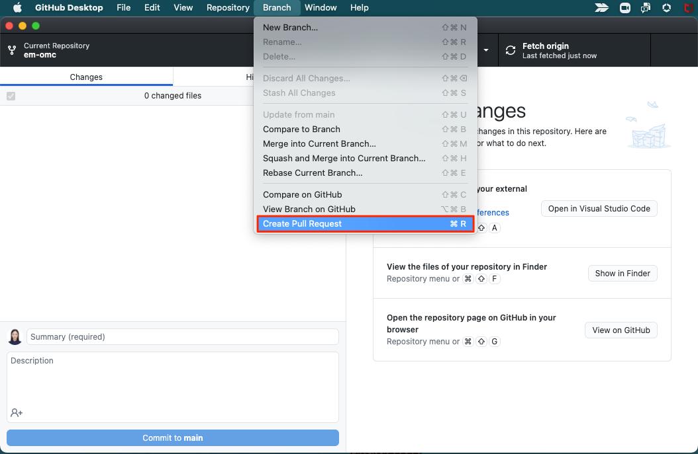
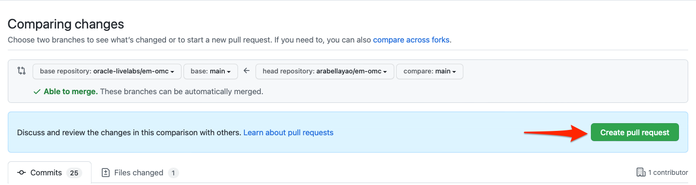
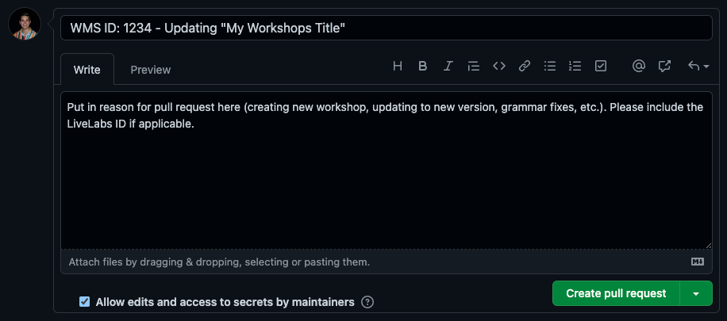

# Publish your workshop

## Introduction

After you have completed self QA and your workshop has been reviewed, it is time to publish your workshop to LiveLabs Production. There are two areas that need to be completed to do this. First is in GitHub, and this is done by a Pull Request to merge your files with the oracle-livelabs/partner-solutions main - production repository. Second is in Oracle LiveLabs system. We, Oracle LiveLabs team will perform all the necessary steps to **Publish** the workshop in LiveLabs production to showcase your workshop.

### Objectives

* Create a Pull Request to upload your content to the main branch
* Submit publish request

### What Do You Need?

* Git Environment Setup
* GitHub Desktop client

This lab assumes that you have completed **Lab 5: QA checks and steps** in the **Contents** menu on the right.

## Task 1: Create a Pull Request to Upload Your Content to the Main Repository

After you complete Self QA and make any other needed updates to your files, you are ready to merge your files and folders to the Oracle LiveLabs Partner Solutions production repositories.

The **Pull Request** is a request that you send to the repository owners and code owners of the **oracle-livelabs/partner-solutions** to approve and host your content on the production **(upstream/main)** repository.

> **Note:**
* *For the community members to contribute content and create a pull request to  oracle-livelabs/partner-solutions repo, you need to fill out the Oracle Contributor Agreement (OCA) document which will be sent to you after your first pull request is created (if you haven’t done that yet). If you are member of the Oracle Organization you don't have to do that.*
* *Before executing a PR, make sure your personal GitHub repo on the web is not behind (See **Lab 3 Task 2** to sync your repo to ensure you have the latest content from production and **GitHub FAQ** on the left menu for the steps to resolve merge conflicts). Failure to do so will result in conflicts.*
* *You cannot issue a pull request without syncing first. PRs will not be approved without your Workshop ID.*
* The council can approve your request, ask for more information if required, or reject your request if your content does not meet the standards for Oracle LiveLabs.

To create a Pull Request:

1. In the **GitHub Desktop** client, make sure you are in **partner-solutions** repo, select **Branch > Create Pull Request** to display a browser interface.

  

2. Click **Create pull request** to display an **Open a pull request** page.

  

3. Enter the title for the pull request, **include your workshop ID**. You can find that by visiting the approved email of the workshop. *Note: PRs will not be approved without this ID.*

4. Click **Create pull request**.

    

A status page is displayed indicating that you have created a pull request along with the request number (for example, #1770), that it is pending review, and that merging is blocked.

When your pull request is approved, the page gets updated with information about your commits being approved and merged into the **upstream/main** repository (production).

When the pull request is approved and merged into the **upstream/main** repository, two emails are sent to the e-mail account associated with your GitHub account.

> **Note:**
* The first email notifies you that your pull request was approved (or rejected).
* If your pull request was approved, then the second email notifies you that your pull request was merged into the **upstream/main** repository.

Your committed content is now visible to the public on the upstream/main or production repository: [oracle-livelabs/partner-solutions](https://github.com/oracle-livelabs/partner-solutions).

> **Note:** If there are any concerns or issues while syncing your GitHub environment, check out the steps to resolve the issues in the GitHub FAQ lab on the left menu.

## Task 2: Request Publishing

1.	The LiveLabs Council team will review the workshop content and verify the QA within next 2-3 business days. The council will reach out to you via email if there are more changes needed and update the status to either **In Development** or **Self QA**. Otherwise, the council will move the workshop into **Completed** status.

2. After moving the workshop to completed status, the LiveLabs council team will submit a new workshop publish request in the LiveLabs system with all the required details you confirmed in the Lab 5 Task 3.

3. It takes 1-2 business days for the new workshop publish request to be approved and for the workshop to be accessible in production for the public. The Oracle LiveLabs council team will notify you with the workshop URL.

Congratulations! You have successfully completed your workshop development. Your workshop will soon be in production.

## What Next?

We recommend you review your content and test the functionality of your workshop regularly or at least quarterly to keep the workshop updated. Feel free to create pull requests with the minor changes like typos, screenshots etc to the workshop as needed.

If you have any questions, or want to make major changes to the workshop or want to request a green button (Green Button can also be added after your workshop has already been in production), email us to [livelabs-help-community_us@oracle.com](livelabs-help-community_us@oracle.com).

## Acknowledgements

* **Author** - Anoosha Pilli, Product Manager, Database Product Management
* **Last Updated By/Date:** Anoosha Pilli, September 2022
