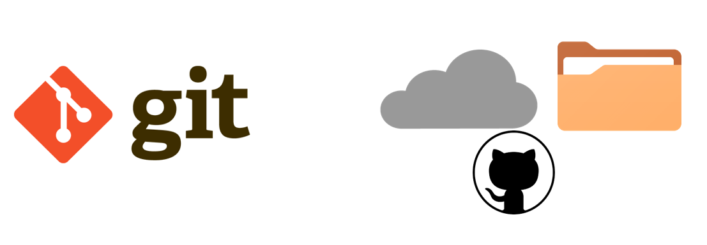
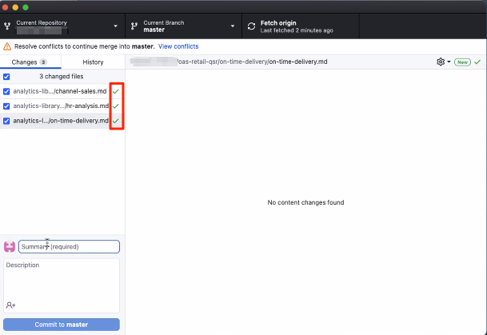
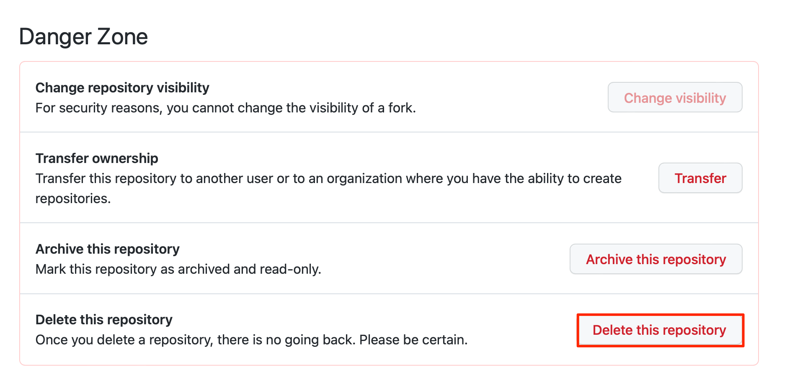
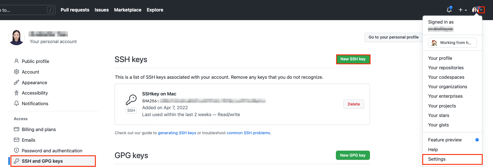

# GitHub FAQ

This lab provide an overview of GitHub, GitHub Projects and Repositories and solutions to frequently asked questions.

## What is GitHub, GitHub Projects and Repositories?

GitHub is a cloud-based version control system designed for software developers.

* At the core of GitHub is Git, an open-source version control system that manages file versions and tracks the changes made by the members of a repository.
* The Hub is a cloud-based repository that manages the storage of the files and provides a folder structure.



GitHub is organized by projects. Each project has its repository (commonly referred to as a repo) that is accessed through a unique URL. As of January 2020, there were more than 190 million repositories on GitHub.

In the following simplified example, the three-drawer filing cabinet represents three GitHub projects (one drawer per project). Each project can contain one or more repositories, represented by folders in the example. In this example, project 2 (second drawer) has three repositories (folders) and we are viewing one of those repositories.

  

## What to do when I am few commits behind oracle:main?

  

1. Follow the steps in Task 1: Get the Latest Updates from Production.

## What to do when clone failed?

  

  1. Execute the following commands to make sure .gitconfig is updated:

    ```
    <copy> git config --global core.longpaths true </copy>
    ```

    ```
    <copy> git config --global core.ignorecase false </copy>
    ```

## How to resolve GitHub merge conflicts?

GitHub merge conflicts happen when you and some other contributors are changing the same content in the oracle-livelabs repositories. Merge conflicts prevent you from pushing your changes to your GitHub repository.

  

1. When you fetch origin and merge changes into your current branch (as in Task 1), you may encounter merge conflicts, as shown in the screenshot above. In the screenshot, you have 3 files that have merge conflicts.

2. Since you are changing the same content as other people, you need to manually decide which version of changes you want to keep. Open your text editor. Go to the files that have conflicts. Conflicts are highlighted by your text editor, and you will choose to use either your changes or other people's changes.

  

3. After you resolve all the conflicts and save your changes, your GitHub Desktop should look like the screenshot below. There will be a green checkmark beside each file, indicating there are no conflicts. Enter the **Summary** and click **Commit to main**. After the commit finishes, you can click **Push origin**, and your changes are pushed to your GitHub repository.

  

4. To confirm, press refresh on your personal GitHub repo on the web, you should have no commits *behind* now, only *ahead*.

  

## I am not able to use GitHub Desktop to pull changes from production

If you have not updated your local GitHub repo with GitHub repo in oracle-livelabs for a long time, and you are too many commits behind the oracle-livelabs:main, you may not get the latest changes from production using GitHub Desktop. It is simply because there are too commits to merge. In that case, you can use git commands to perform the same actions.

*Git commands are not as straightforward as GitHub Desktop, so feel free to reach out to our team for help in the Slack channel, and our team is there to help you.*

>**Note:** Make sure you are performing the following actions **off VPN**.

1. Navigate to your local GitHub repository or your workshop folder in your terminal or VScode.

2. Make sure you have Git installed.

3. Run the command to see if the *origin* is pointing to your repo, and *upstream* to the repo in Oracle LiveLabs.

    ```
    <copy>
    git remote -v
    </copy>
    ```

4. If yes, only then run these below commands to sync your repo:

  Fetch the latest changes from the repo in the Oracle LiveLabs GitHub project

    ```
    <copy>
    git fetch upstream
    </copy>
    ```

  Merge the changes from the repo in Oracle LiveLabs to your local repo
    ```
    <copy>
    git merge upstream/main -m "Sync with main"
    </copy>
    ```

    Push the locally updated version (merged changes in your local repository from the repo in Oracle LiveLabs) to your staging repo (on the browser)

    ```
    <copy>
    git push origin main
    </copy>
    ```

5. If there are any conflicts run the command to view the conflicting flies. You can also use GitHub Desktop to see the conflicting files.

    ```
    <copy>
    git diff --name-only --diff-filter=U
    </copy>
    ```

  Navigate to the conflicting files and resolve the conflicts by choosing the incoming changes or current changes.
  Once conflicts are resolved, commit the changes in your GitHub desktop and push them.

## I have messed up my GitHub repo and want to delete it

>**Note:** Do this only if necessary.

In the worst case, if you cannot resolve issues in your local or staging repo, and want to delete your entire repository, follow the below steps:

1. Open up a browser. Go to your repository (your fork). Click **Settings**.

  

2. Scroll down and click **Delete this repository**.

  

3. Enter &lt;your\_github\_user\_name&gt;/&lt;repo\_name&gt;.

4. Click the **I understand the consequences, delete this repository** button.

  This deletes the entire repo in your local/laptop. Follow the labs in this guide to set up your repo again.

## I am getting authentication error

  

First, make sure that you are logged into your GitHub account in GitHub Desktop. If it still does not solve the error, try the following steps.

If you have already created an SSH key in your local computer and added the key to your GitHub account, you can go directly to Step 5.

1. If you have not generated SSH keys in your local computer, first follow the *(Optional) Lab 5: Generate SSH keys* on the left to generate SSH keys in your local computer.

2. Now you have your public and private SSH keys. Go to your GitHub account in a browser. Click the arrow next to your profile picture on the upper right, and click **Settings**. Click **SSH and GPG keys**. If you have not added any SSH keys to your GitHub account, you will not see any SSH keys displayed. Then click **New SSH key**.

  

3. For **Title**, give your SSH key a name. In the **Key** field, copy and paste your public SSH key. Then, click **Add SSH key**.
  

4. After the SSH key is added, you can see it under SSH keys on your GitHub page.
  

5. Open up your terminal. Go to where *you cloned your **partner-solutions** GitHub repository* (which is different from the example below). In this example, we are using the em-omc repository to demonstrate, but the process is the same for other repositories.

    ```
    user@user-mac ~ % cd Documents/oracle-livelabs/em-omc
    user@user-mac em-omc %
    ```
6. Run the ssh-agent command.

    ```
    user@user-mac em-omc % <copy> ssh-agent -s </copy>
    SSH_AUTH_SOCK=/var/folders/sl/pt8rm4rd4tl_f8yyd8n6jd640000gn/T//ssh-vkOzi3x2qhp7/agent.82390; export SSH_AUTH_SOCK;
    SSH_AGENT_PID=82391; export SSH_AGENT_PID;
    echo Agent pid 82391;
    ```

7. Run the ssh-add command. Append your private SSH key after the ssh-add. Yours may be different from what is shown below.

    ```
    user@user-mac em-omc % <copy> ssh-add ~/.ssh/sshkey </copy>
    Identity added: /Users/user/.ssh/sshkey (user@user-mac)
    ```

8. Finally, go back to **GitHub Desktop** UI, and click **Push origin**. This should solve the authentication issue, and you can continue the lab.

  

## My GitHub Desktop is stuck

1. First make sure that you are off VPN.

2. Re-open the GitHub desktop.

## My GitHub Desktop does not reflect the repo I work on

If you have multiple Oracle LiveLabs repositories, you need to switch to the repository that you will work on in GitHub Desktop. Expand the dropdown list of **Current Repository**, and click the repository that you need.

  

## Acknowledgements

* **Author** - Anoosha Pilli, Product Manager, Database Product Management
* **Last Updated By/Date:** Anoosha Pilli, July 2022