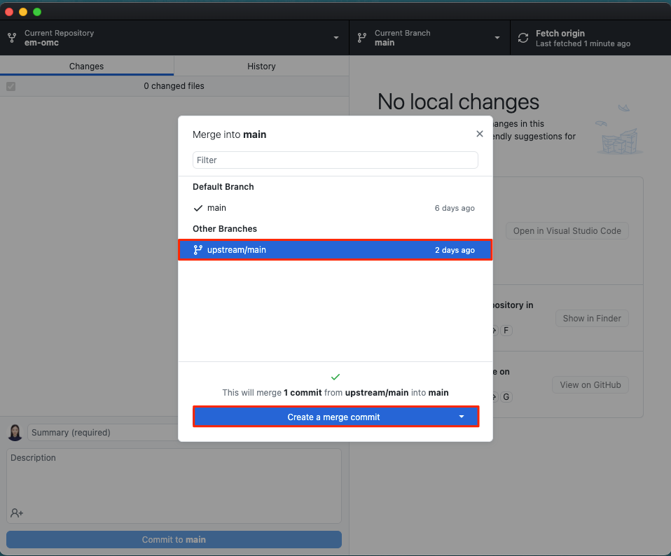
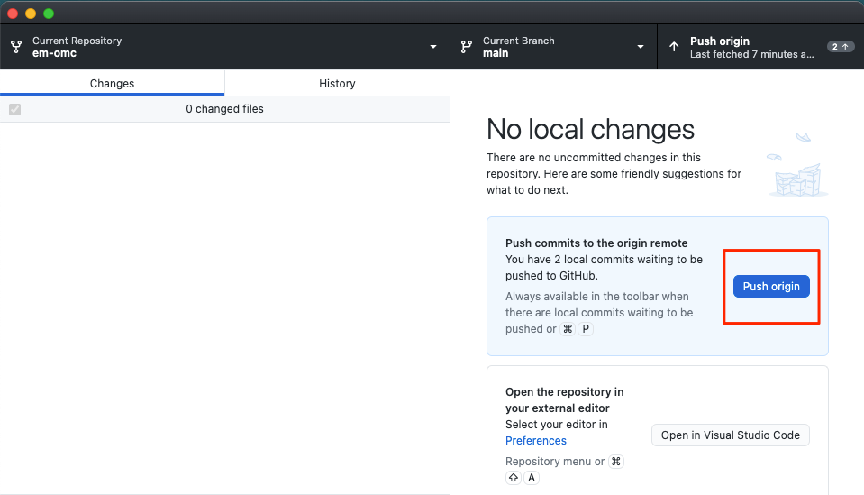
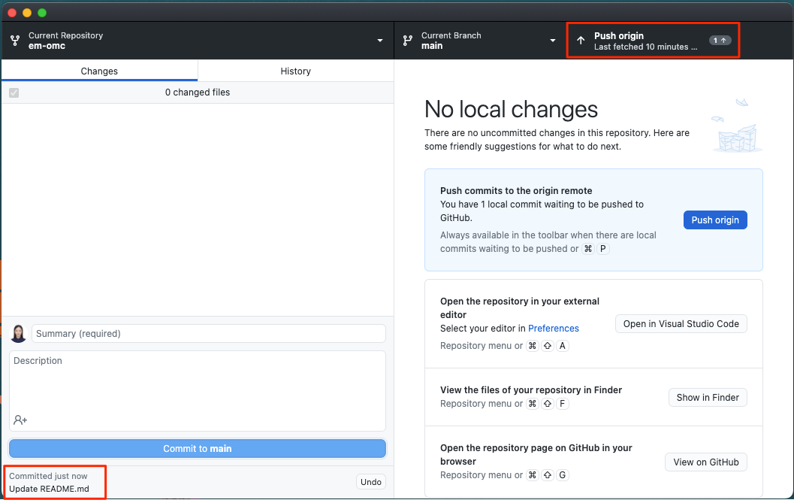

# Use GitHub Desktop to Commit to the GitHub Repository

## Introduction

As a best practice, merge your repository every day or whenever you start your GitHub Desktop application. *Merge* pulls all the commits (changes) from the [oracle-livelabs/partner-solutions](https://github.com/oracle-livelabs/partner-solutions) repository, into your local filesystem clone (local machine). This keeps your local clone up-to-date with other people's work (commits) from the upstream/main. Next, you push the updated content from your clone into the origin of your clone, that is, your fork, to synchronize your clone with your fork. Merging also avoids the long time it could take to complete if you don't do that often.

### Objectives

* Commit your changes
* Request for a review
* Test your content
* Create a Pull Request to upload your content to main

### What Do You Need?

* Git Environment Setup
* GitHub Desktop client

This lab assumes that you have completed **Lab 3: Use a Text Editor to Develop Markdown Content** in the **Contents** menu on the right.

Watch this video below on how to self-QA your workshop.
[](youtube:8tirP-hibsk)

## Task 1: Get the Latest Updates from Production

Before you develop you should ensure you have the latest content from production to ensure you are developing off the latest code set.

1. Go to your personal GitHub repo on the web and determine if your personal repo is behind the main.  If it is, perform the following steps to sync.  This should be done before you commit.

  Here we are using the em-omc repository as an example, but the following process is the same for your **partner-solutions** repository.

  

2. Start your **GitHub Desktop** client. If you have multiple repositories, first switch to the repository that you will work on. Expand the dropdown list of **Current Repository**. Click the **partner-solutions** repository as that is the repo you may want to sync.

  In this case, we selected the em-omc repository.

  

3. Click **Fetch origin**. Then, go to **Branch** -> **Merge into Current Branch**.

  

  > **Note:** If you get an authentication error, please refer to the Lab 6 - GitHub FAQ to resolve the issue.

4. Select the branch **upstream/main** (there may be several branches, search until you see *upstream/main*). Press the **Create a merge commit** button.

  

5. Finally, select **Push origin**.

  

6. To confirm, press refresh on your personal GitHub repo on the web, you should have no commits *behind* now, only *ahead*.

  

## Task 2: Commit your Changes in your Clone

When you create, delete, or modify assets in your clone (local copy), you should commit (save) those changes to your clone, and then push those changes from your clone to your fork. Then these changes get saved to your forked repository.

To commit your changes:

1. Start your **GitHub Desktop** client.

2. In the **Summary (required)** text box on the left (next to your profile picture), enter a summary of your changes. You can optionally add a more detailed description of your changes in the **Description** text box.

  

3. Click **Commit to main**. This saves your changes in your local clone. **Fetch origin** changes to **Push origin**.

4. Click **Push origin** (it should have an upward arrow with a number). This pushes the updated content from your clone into the origin of this clone, that is, your fork.

  

## Task 3: Set Up GitHub Pages for your Fork to Test your Content

The GitHub Web UI has a feature called **Set Up GitHub Pages for Your Fork** to test your content. This feature performs a dynamic conversion of the Markdown files (.md files you have developed using your Atom Editor) to HTML. After you upload the content from your clone to your fork, you can preview your workshop and labs on your forked repository with **your GitHub Pages site URL** (or the URL of your forked repository). You can also provide this URL with your workshop team members and the Oracle LiveLabs council team members to review this content.

> **Note:** You should perform the following actions in your forked GitHub repository (e.g. [https://github.com/anooshapilli/partner-solutions](https://github.com/anooshapilli/partner-solutions)), instead of the production repository (e.g. [https://github.com/oracle-livelabs/partner-solutions](https://github.com/oracle-livelabs/partner-solutions)).

To publish your GitHub Pages site:

1. Log in to [GitHub Web UI](http://github.com) using your GitHub account credentials.

2. Click your **partner-solutions** fork link in the **Repositories** section to open your fork.

  Here we are using the em-omc repository as an example, but the following process is the same for your **partner-solutions** repository.

  

3. Click **Settings** in your **partner-solutions** fork.

   

4. On the left menu, click **Pages**.

  

5. Under **Source**, select **main** (if it's not already selected) from the drop-down list and click **Save**.

  

6. Optional: Under **Theme Chooser**, click **Change Theme** and select a theme of your choice.

7. This may take a few minutes to complete. After the GitHub Pages are enabled, the message under **GitHub Pages** changes and provides the link to your user account GitHub Pages site for the **partner-solutions** repo.

	In this example, it displayed the message with GitHub Pages site URL for the arabellayao user account and em-omc repo - **Your site  is published at https://arabellayao.github.io/em-omc/**

  

8.	Save your Github Pages site link for later use.

## Task 4: Share your Workshop for Review

After you have successfully set up your GitHub pages, you can share your **Development GitHub URL** of the workshop for review.

To share and view your workshop:

1. In the new tab of the browser, type or paste the URL of your GitHub Pages site.

2. Then append the URL with the path to the index.html file in either tenancy or desktop or sandbox version in the workshops folder of your workshop for the version you want to share the link for review. This link will be your **Development GitHub URL**.

	For example, if anooshapilli user wants to share the tenancy version of sample-workshop in the partner-solutions repository for review, the user would append their GitHub Pages URL - [https://anooshapilli.github.io/partner-solutions/](https://anooshapilli.github.io/partner-solutions) with the path to index.html file in tenancy folder - **partner-solutions/sample-livelabs-templates/sample-workshop/workshops/tenancy/index.html**. Then the complete URL will look similar to this [https://anooshapilli.github.io/partner-solutions/sample-livelabs-templates/sample-workshop/workshops/tenancy/index.html](https://anooshapilli.github.io/partner-solutions/sample-livelabs-templates/sample-workshop/workshops/tenancy/index.html) which can be shared for review.

## Task 5: Create a Pull Request to Upload Your Content to the Main Repository

The **Pull Request** is a request that you send to the repository owners and code owners of the **oracle-livelabs/partner-solutions** to approve and host your content on the production **(upstream/main)** repository.

> **Note:**
* *Before executing a PR, make sure you have run Task 1 above and that your personal GitHub repo on the web is not behind. Failure to do so will result in conflicts.*
* *You cannot issue a pull request without syncing first. PRs will not be approved without your Workshop ID.*
* The council can approve your request, ask for more information if required, or reject your request if your content does not meet the standards for Oracle LiveLabs.

To create a Pull Request:

1. In the **GitHub Desktop** client, make sure you are in **partner-solutions** repo, select **Branch > Create Pull Request** to display a browser interface.

  

2. Click **Create pull request** to display an **Open a pull request** page.

  

3. Enter the title for the pull request, **include your workshop ID**. You can find that by visiting the approved email of the workshop. *Note: PRs will not be approved without this ID.*

4. Click **Create pull request**.

    

A status page is displayed indicating that you have created a pull request along with the request number (for example, #1770), that it is pending review, and that merging is blocked.

When your pull request is approved, the page gets updated with information about your commits being approved and merged into the **upstream/main** repository (production).

When the pull request is approved and merged into the **upstream/main** repository, two emails are sent to the e-mail account associated with your GitHub account.

> **Note:**
* The first email notifies you that your pull request was approved (or rejected).
* If your pull request was approved, then the second email notifies you that your pull request was merged into the **upstream/main** repository.

Your committed content is now visible to the public on the upstream/main or production repository: [oracle-livelabs/partner-solutions](https://github.com/oracle-livelabs/partner-solutions).

## Task 6: Access your workshop on GitHub Repository

After your pull request is complete, wait a few minutes and perform the steps below. Github pages take approximately 5-10 minutes for the pages to be copied.

1. For example, if **anooshapilli/partner-solutions** (forked version) repo has the **sample-workshop** workshop located in the path below:

	```
	https://github.com/anooshapilli/partner-solutions/blob/main/sample-livelabs-templates/sample-workshop/workshops/tenancy/index.html
    ```

2.	Once the PR is approved, the **sample-workshop** workshop will be located in the path below of the **oracle-livelabs/partner-solutions** repo (production).

    ```
	https://github.com/oracle-livelabs/partner-solutions/blob/main/sample-livelabs-templates/sample-workshop/workshops/tenancy/index.html
    ```

3. You can construct the **Production Github URL** by replacing your username in the **Development GitHub URL** with **oracle-livelabs** or you can follow the steps in task 4 to create your workshop's Production Github URL.

    ```
    https://oracle-livelabs.github.io/partner-solutions/sample-livelabs-templates/sample-workshop/workshops/tenancy/index.html
    ```

## Task 7: Change your status

Now that your workshop is inside the Oracle LiveLabs GitHub project, confirm the LiveLabs council about your workshop status by emailing us to [livelabs-help-community_us@oracle.com](livelabs-help-community_us@oracle.com).

1. If you still have some workshop development or changes to do, the LiveLabs council will update the status of the workshop to **In Development**.

2. If you are finished with the workshop development and ready to perform QA (details in Task 8 of this lab), the LiveLabs council will update the status of the workshop to **Self QA**.

3.  If your workshop is already in production, and want to make minor changes to your workshop, you will need to mail us to [livelabs-help-community_us@oracle.com](livelabs-help-community_us@oracle.com) to edit it.

## Task 8: Self QA

You have finished developing your workshop. To publish your workshop, you still need to perform self-QA on the workshop. If there are changes to the details below, email us to [livelabs-help-community_us@oracle.com](livelabs-help-community_us@oracle.com) to keep the system updated.

1.  Make sure the **Workshop Title** you submitted while requesting a new workshop matches with the workshop title in development, and the details provided in **Short Description**, **Long Description**, **Workshop Outline**, **Workshop Prerequisites**, **Publish Type**, **Workshop Environment** and **Workshop Time** fields are still valid. These are the details that will be displayed on the workshop homepage when the workshop is live.

2.  Share us the **Development GitHub URL** which is the link to your workshop in your personal GitHub Pages site that we identified at Task 4. After your workshop has been added to oracle-livelabs/repository (your pull request has been merged), we will update our records with the **Production GitHub URL**. You can construct the Production URL by replacing your username in the **Development GitHub URL** with **oracle-livelabs** that we identified in Task 6.

3. Confirm if the **Level**, **Role**, **Focus Area**, and **Product** tags details shared with us while submitting the workshop are up-to-date. Tags help people find your workshop in LiveLabs.

4. Download this [Self QA document](https://objectstorage.us-ashburn-1.oraclecloud.com/p/MKKRgodQ0WIIgL_R3QCgCRWCg30g22bXgxCdMk3YeKClB1238ZJXdau_Jsri0nzP/n/c4u04/b/qa-form/o/QA.docx). To align with the LiveLabs standards, check your workshop against the form, make changes to your changes to your workshop as needed and fill out the form. Create a new pull request if necessary with the changes made.

	Workshop author or the team can watch the video below on how to self-QA or verify QA of the workshop.

	[Self QA](youtube:8tirP-hibsk)

5. Confirm us the above details in task 8, the status of your workshop if the self QA is completed and email us the completed Self QA document to [livelabs-help-community_us@oracle.com](livelabs-help-community_us@oracle.com). Once we have these details we will update the status to **Self QA Complete**.

## Task 9: Request Publishing

1.	The LiveLabs Council team will review the workshop content and verify the QA within next 2-3 business days. The council will reach out to you via email if there are more changes needed and update the status to either **In Development** or **Self QA**. Otherwise, the council will move the workshop into **Completed** status.

2. After moving the workshop to completed status, the LiveLabs council team will submit a new workshop publish request in the LiveLabs system with all the required details you confirmed in the Task 8.

3. It takes 1-2 business days for the new workshop publish request to be approved and for the workshop to be accessible in production for the public. The Oracle LiveLabs council team will notify you with the workshop URL.

Congratulations! You have successfully completed your workshop development. Your workshop will soon be in production.

## What Next?

We recommend you review your content and test the functionality of your workshop regularly or at least quarterly to keep the workshop updated. Feel free to create pull requests with the minor changes like typos, screenshots etc to the workshop as needed.

If you have any questions, or want to make major changes to the workshop or want to request a green button (Green Button can also be added after your workshop has already been in production), email us to [livelabs-help-community_us@oracle.com](livelabs-help-community_us@oracle.com).

## Acknowledgements

* **Author** - Anoosha Pilli, Product Manager, Database Product Management
* **Last Updated By/Date:** Anoosha Pilli, July 2022