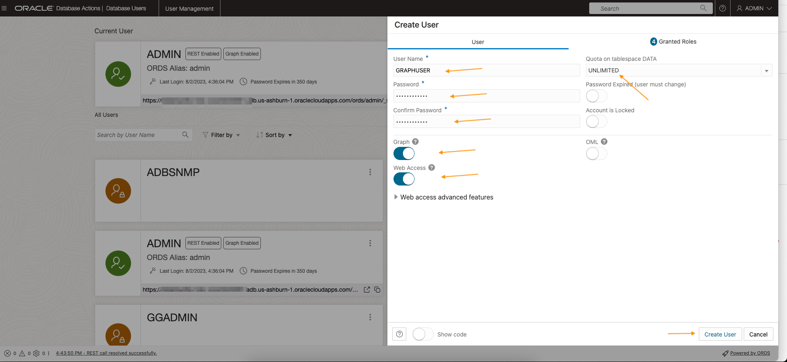
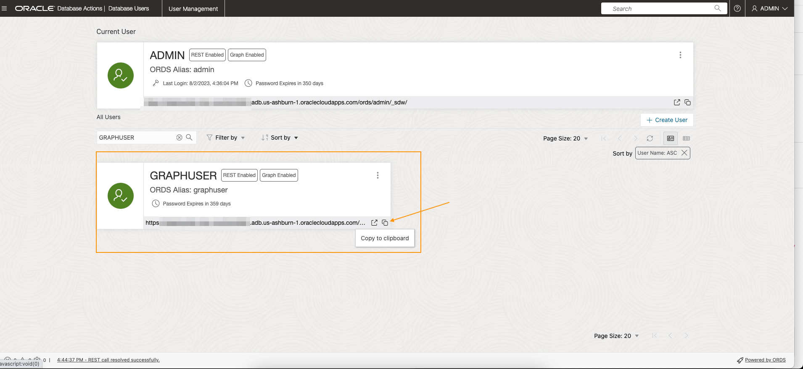

# Create the Graph User

## Introduction

In this lab you will create a database user with the appropriate roles and privileges required for using the graph capabilities of the Autonomous Database.

Estimated Time: 5 minutes.

Watch the video below for a quick walk through of the lab.

[Link to video of this workshop](youtube:CQh8Q24Rboc)

### Objectives

Learn how to

-  create a database user with the appropriate roles and privileges required for accessing **Graph Studio**

### Prerequisites

- The following lab requires an Autonomous Data Warehouse - Serverless or Autonomous Transaction Processing - Serverless account

## Task 1: Connect to the Database Actions for your Autonomous Database instance

1. Open the service detail page for your Autonomous Database instance in the OCI console.  

   Then click the **Database Actions-->Database Users** link to open it.

   

## Task 2: Create the web access and graph-enabled user

1. Click the **+ Create User** icon.

    

2. Enter the required details, i.e. user name and password. Turn on the **Graph Enable** and **Web Access** radio buttons. And select a quota, e.g. **UNLIMITED**,  to allocate on the `DATA` tablespace.  

   	Note: The password should meet the following requirements:

	- The password must be between 12 and 30 characters long and must include at least one uppercase letter, one lowercase letter, and one numeric character.
	- The password cannot contain the username.
	- The password cannot contain the double quote (“) character.
	- The password must be different from the last 4 passwords used for this user.
	- The password must not be the same password that is set less than 24 hours ago.

	

	**Note: Please do not login to Graph Studio as the ADMIN user. The ADMIN user has additional privileges by default. Create and use an account with only the necessary privileges for use with graph data and analytics.**

	Click the **Create User** button at the bottom of the panel to create the user with the specified credentials.

	The newly created user will now be listed.  Copy the user-specific URL to login to Database Actions as the newly created user.

	   

This concludes this lab.  
**You may now proceed to the next lab.** 

## Acknowledgements

* **Author** - Jayant Sharma, Product Management
* **Contributors** -  
* **Last Updated By/Date** - Jayant Sharma, July 2023
