# Graph Studio: Create a property graph view on database content

## Introduction

In this lab you will create a graph from the `ocw_nodes` and `ocw_edges` tables using Graph Studio.

Estimated Time: 10 minutes.

Watch the video below for a quick walk through of the lab.

[Link to video of lab](videohub:1_12j0i1tw)

### Objectives

Learn how to

- Use Graph Studio to model and create a graph from existing tables or views.

### Prerequisites

- The following lab requires an Autonomous Database - Serverless account.
- And that the Graph-enabled user (`GRAPHUSER`) exists. That is, a database user with the correct roles and privileges exists.

## Task 1: Log into Graph Studio

Graph Studio is a feature of Autonomous Database. It is available as an option on the Database Actions Launchpad. You need a graph-enabled user to log into Graph Studio. When you created the GRAPHUSER user in an ealier lab, you had graph-enabled that user.

1. If you are still logged in as GRAPHUSER in Database Actions then navigate to its landing page and click the Graph Studio tile. Or log back in if you are logged out. 

    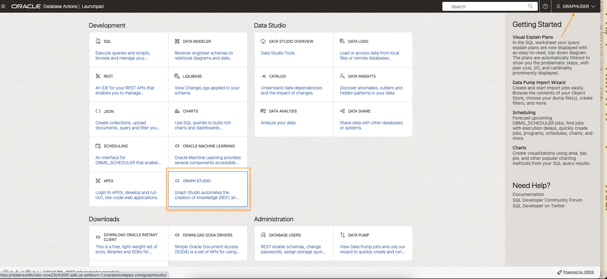    

2. If you closed the page and do not have the URL then go to the console for you ADB instance and click the Tools Configuration tab and copy the Graph Studio url from there. 

    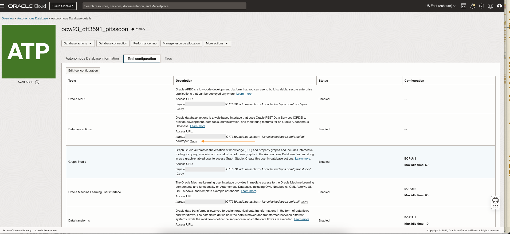

3. Log in to Graph Studio. Use the credentials for the database user GRAPHUSER.

    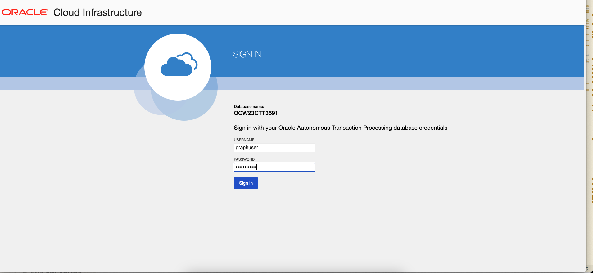

    Graph Studio consists of a set of pages accessed from the menu on the left. We will use the following pages in this lab.  

    The Home icon  takes you to the Home page.  
    The Graph page  lists existing graphs, and lets you create one, for use in notebooks.  
    The Notebook page  lists existing notebooks and lets you create a new one.  
    The Jobs page  lists the status of background jobs and lets you view the associated log if any.  

## Task 2: Create a graph of application artefacts and their and connections

1. Click the **Graph** icon to navigate to page for creating a new graph and listing existing ones.  
   
    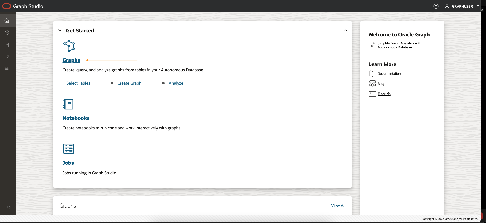  

    Then click **Create Graph**.  
   
    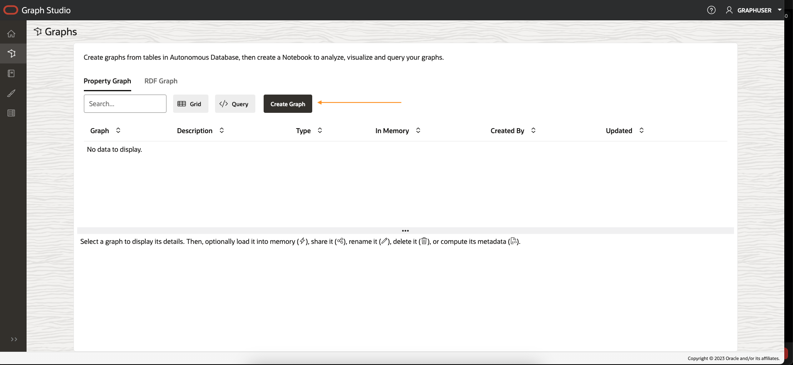  

2. Enter `ocw_software_analysis` as the graph name, then click **next**. The description and tags fields are optional.   
    That graph name is used throughout the next lab.  
    Do not enter a different name because then the queries and code snippets in the next lab will fail.  
    
    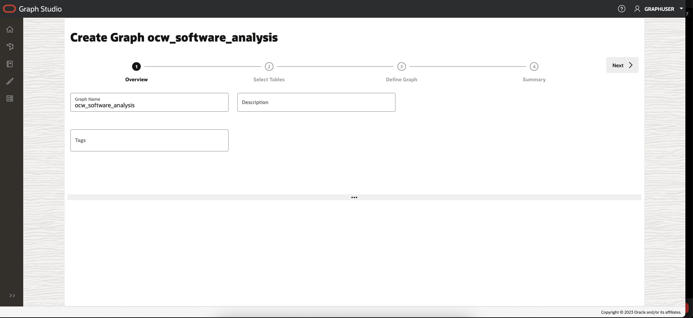

3. Expand **GRAPHUSER** and select the `OCW_NODES` and `OCW_EDGES` tables. 

    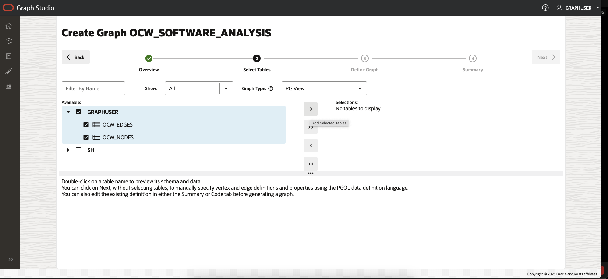

4. Move them to the right, that is, click the first icon on the shuttle control.   

    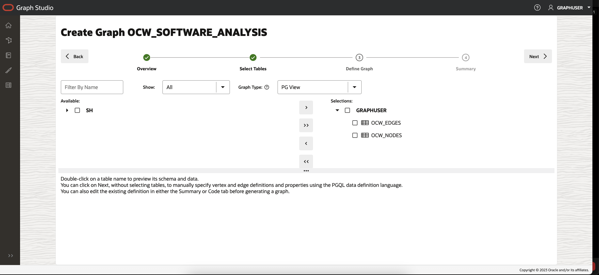

5. Click **Next**. We will check the suggested edge direction graph and reverse it if necessary.  

    The suggested graph has the `OCW_NODES` as a vertex table since there are foreign key constraints specified on `OCW_EDGES` that reference it.   

    And `OCW_EDGES` is a suggested edge table. Click on the Edge table to see the source and destination keys. 

    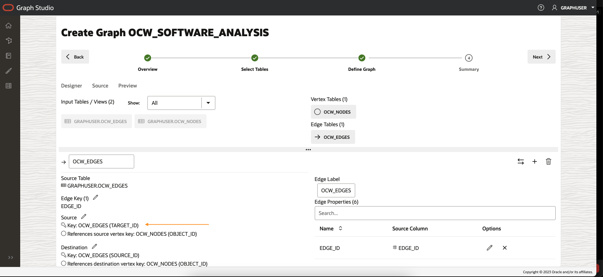   

    Note that `TARGET_ID` is the source and `SOURCE_ID` is the destination. So we need to reverse the edge direction. 

    Click the Swap Direction icon on the right.  
    
   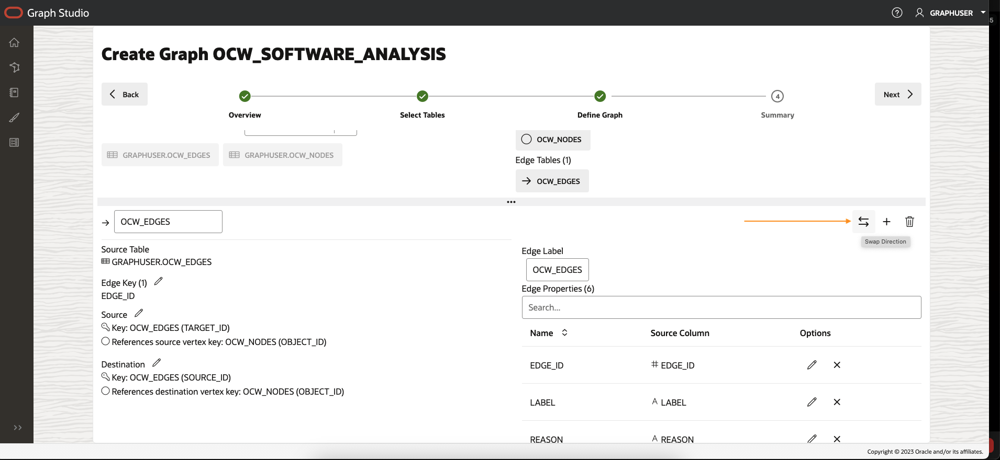  

    Note that the key for the source vertex is now `SOURCE_ID`.

    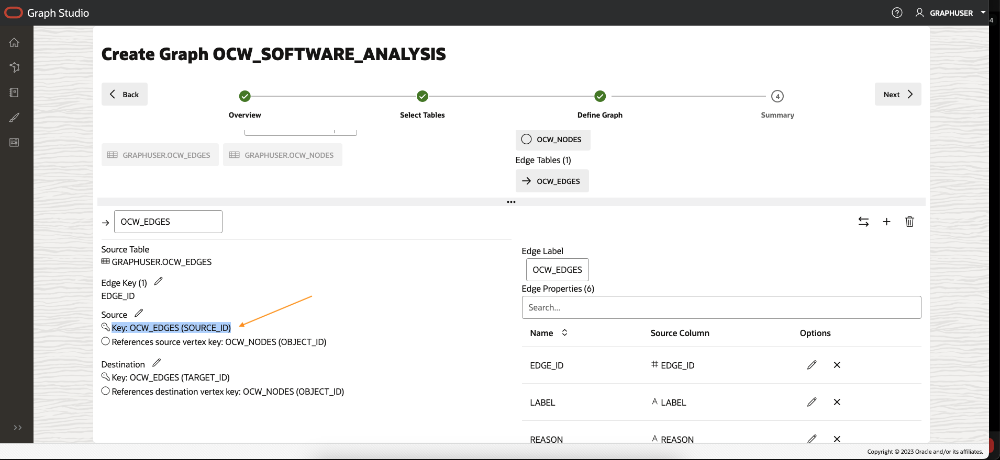

    Click **Next**. 

6. In the Summary step, click on **Create Graph**.  

    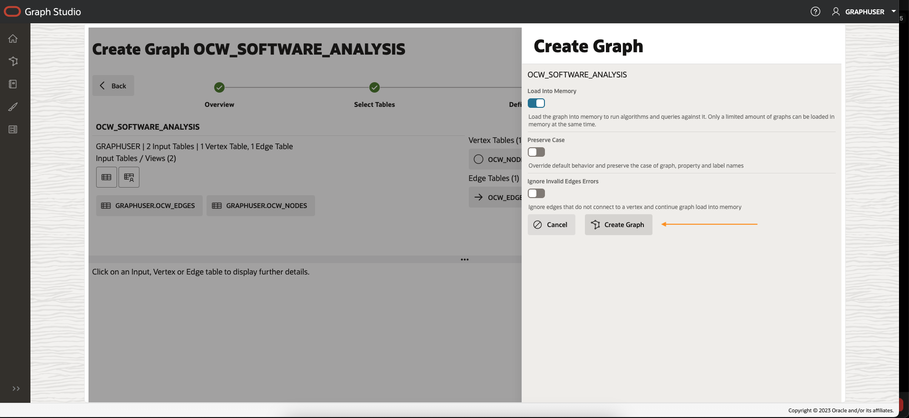  

    This will open a Create Graph dialog. Leave the defaults as is and click the Create Graph button

    

    You will be taken to the Jobs page which lists the spawned tasks. Refresh the page to see their status. 

   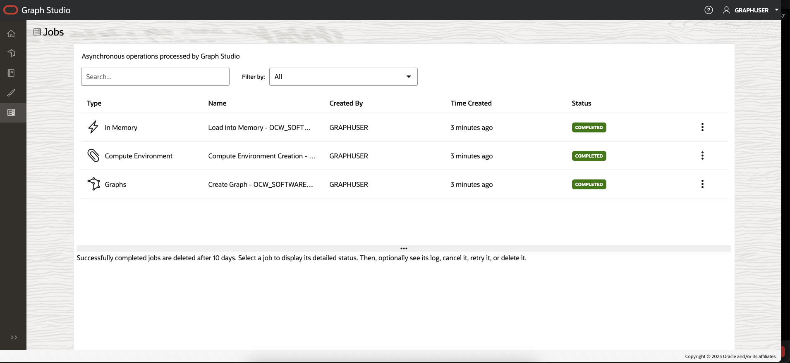

    This concludes this lab. **You may now proceed to the next lab.**

## Acknowledgements

* **Author** - Jayant Sharma, Product Management
* **Contributors** -  , Product Management
* **Last Updated By/Date** - Jayant Sharma, July 2023

