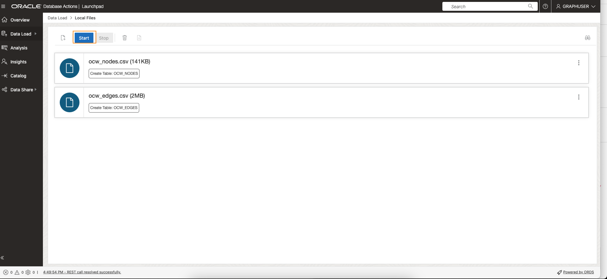
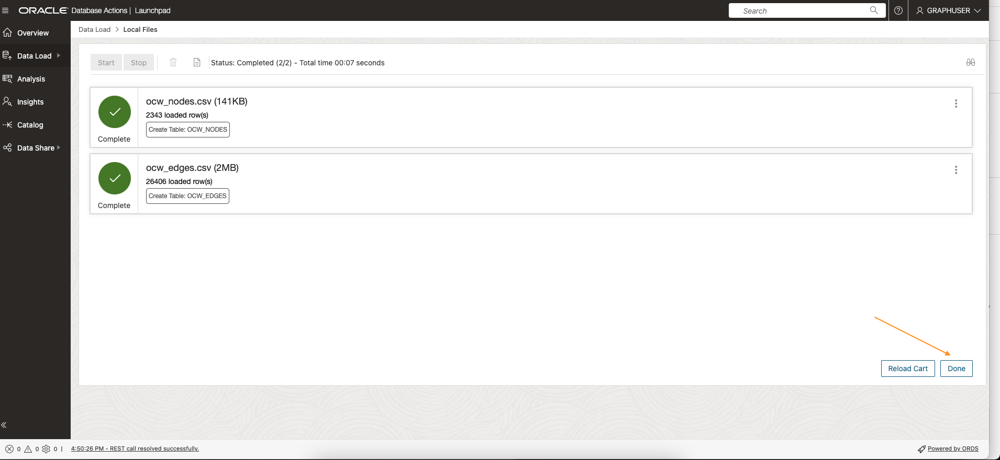

# Database Actions: Load data from CSV files into tables

## Introduction

In this lab you will load two CSV files into corresponding tables using the Database Actions interface of your 
Oracle Autonomous Database instance.


Estimated Time: 10 minutes.
<!--
Watch the video below for a quick walk through of the lab.

[](youtube:wkKKO-RO0lA)
-->

### Objectives

Learn how to
- load CSV files into an Autonomous Database using Database Actions

### Prerequisites

- The following lab requires an Oracle Autonomous Database account. 
- It assumes that a Graph and Web-Access enabled user exists. That is, a database user with the correct roles and privileges exists and that user can log into Database Actions.

## Task 1: Connect to the Database Actions for your Autonomous Database instance

1. Paste the URL you copied in the previous lab in a new browser tab or window.  
   If you did not copy it and have a tab where you are logged in as ADMIN to Database Actions then logout so that you can log back in as the graph-enabled user.  
   If you don't have Database Actions open and don't have the URL then go back to the OCI Console page for the Autonomous Database. Open Database Actions from there and then logout once it opens up and is connected. 

 
## Task 2: Login as the graph-enabled user

1. Login as the graph user (for example, `GRAPHUSER`) for your Autonomous Database instance. 
   
      

    >**Note:** *If necessary, do the following to create the user with the right roles and privileges*:
    - Log in to Database Actions as the **ADMIN** user for your Autonomous Database
    - Select **Administration** and then **Database Users** from the navigation menu
    - Click **Create User**
    - Turn on the **Web-Access** and **Graph** buttons

## Task 3: Download the sample datasets from the ObjectStore

1. Copy and paste the url in your browser for the zip archive, that is  

     ```
     <copy>
     https://objectstorage.us-ashburn-1.oraclecloud.com/p/b1_vZe_9llVqw_oTDq-SQyRrkDshcuABTHc6QuUDG984jfUi0mbk5x7pOZ7mPDPh/n/c4u04/b/livelabsfiles/o/partner-solutions/analyze-app-dependancy-with-graph-studio/PITSS_OCW_DATA.zip
     </copy>
     ```

    Or use `wget` or `curl` to download the sample data to you computer.   
    An example `curl` request that you can copy and paste is:

     ```
     <copy>
     curl -G -o pitss-ocw-data.zip https://objectstorage.us-ashburn-1.oraclecloud.com/p/b1_vZe_9llVqw_oTDq-SQyRrkDshcuABTHc6QuUDG984jfUi0mbk5x7pOZ7mPDPh/n/c4u04/b/livelabsfiles/o/partner-solutions/analyze-app-dependancy-with-graph-studio/PITSS_OCW_DATA.zip
     </copy>
     ```

2. **Unzip** the archive into a local directory such as ~/downloads.

## Task 4: Upload using Database Actions Data Load

1. Click the **DATA LOAD** card. 
   
    
   
    Then specify the location of your data. That is, make sure the **LOAD DATA** and the **LOCAL FILE** cards have a check mark. Click **Next**.

    

2. Click **Select Files**.
   
     

    Navigate to the correct folder (for example, ~/downloads/pitss-ocw-data) and select the `ocw_nodes.csv` and `ocw_edges.csv` files.

    

3. Verify the column names and datatypes that will be used when creating the corresponding database tables.  Click on the file name `ocw-nodes.csv`.  
     

   View the properties. The `WEIGHT` column should be of type `NUMBER` instead of `VARCHAR2`.  MAke the change and click Close.  
     

   Optionally check the properties for the `ocw_edges.csv' file too.  Then click Close. 
   
   `
4. Now click the **Start** button to execute the data load job.
    

5. Confirm that you wish to start the data load job.

    

6. Once the files are loaded 
   
      

    Click **Done** to exit.


7. Now open the **SQL** Worksheet.
    

8. Enter the following SQL statements to define the primary key and foreign keys for the `OCW_NODES` and `OCW EDGES` tables.  `

     ```
     <copy>
     alter table ocw_nodes add constraint ocw_nodes_pk primary key (object_id);
      
     alter table ocw_edges add constraint ocw_edges_pk primary key (edge_id);

     alter table ocw_edges add constraint ocw_edges_fk1 foreign key source_id references ocw_nodes (object_id);

     alter table ocw_edges add constraint ocw_edges_fk2 foreign key target_id references ocw_nodes (object_id);

     </copy>      
     ```

    It does the following:
    - Adds a primary key constraint to the `ocw_nodes` table
    - Adds a primary key constraint to the `ocw_edges` table
    - Adds a foreign key constraint to the `ocw_edges` table specifying that `source_id` references `ocw_nodes.object_id`
    - Adds a second foreign key constraint to the `ocw_edges` table specifying that `target_id` references `ocw_nodes.object_id` 

9.  Execute the script in the SQL worksheet.  
      
   
  

    Please **proceed to the next lab** to create a graph from these tables.

## Acknowledgements
* **Author** - Jayant Sharma, Product Management
* **Contributors** -  
* **Last Updated By/Date** - Jayant Sharma, July 2023