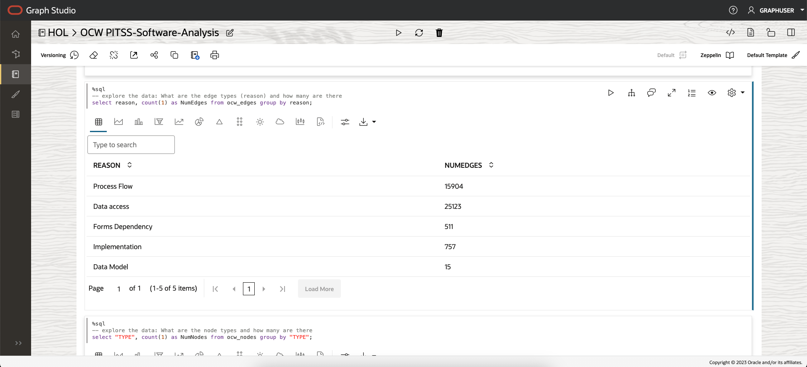

# Query, analyze, and visualize the graph

## Introduction

In this lab you will query and analyze the newly created graph (that is, `ocw_software_analysis`) in a notebook.

Estimated Time: 30 minutes.

Watch the video below for a quick walk-through of the lab.
[Query and visualize the property graph](videohub:1_krj0gcys)


### Objectives

Learn how to

- Import a notebook
- Use Graph Studio notebooks and PGQL and Python paragraphs to query, analyze, and visualize a graph

### Prerequisites

- Earlier labs of this workshop. That is, the graph user exists, you have logged into Graph Studio, and created a graph

## Task 1: Import the notebook 

The instructions below show you how to import the sample notebook, and change default visualization settings as needed.  
First **import** the sample notebook and then execute the relevant paragraph for each step in task 2.   

1. If you did not download the workshop resources in Lab 3 or need to do that again, use this [**link**](https://objectstorage.us-ashburn-1.oraclecloud.com/p/b1_vZe_9llVqw_oTDq-SQyRrkDshcuABTHc6QuUDG984jfUi0mbk5x7pOZ7mPDPh/n/c4u04/b/livelabsfiles/o/partner-solutions/analyze-app-dependancy-with-graph-studio/PITSS_OCW_DATA.zip "URL for workshop resources").

2. Click the **Notebooks** menu icon and then on the **Import** notebook icon on the top right.  

      

3. Drag the downloaded file or navigate to the correct folder and select it for upload.  
    
      

4. Click **Import**.
  
     

5. Once imported, it should open in Graph Studio.  You will see a message about a compute environment being attached. That process takes about 30 seconds.  

      

    Once complete, you can execute the paragraphs in sequence and experiment with visualizations settings as described in **Task 2** below.  

## Task 2: Load and query the `OCW_SOFTWARE_ANALYSIS` graph and visualize the results

The notebook explores the dataset and the property graph view of the data. It shows you how to create a subgraph of interest, from the original graph, and then run a community detection algorithm on it and query and visualize the results of that analysis. 

In this task, we will run the graph queries and use the settings tool to customize the graphs. You can alter the settings to explore available options.

>**Note:** *Execute the relevant paragraph after reading the description in each of the steps below*.
If the compute environment is not ready as yet and the code cannot be executed then you will see a blue line moving across the bottom of the paragraph to indicate that a background task is in progress.  


1. The first few paragraphs contain SQL queries to explore the `OCW_NODES` and `OCW_EDGES` tables. Note that edges have a `REASON` attribute with possible values being {`Forms Dependency`, `Data Model`, `Data access`, `Implementation`, `Process Flow`}. We will these when loading the subgraph to analyze.  

  

2. Next, we load the graph into the in-memory graph server in order to execute some graph algorithms.

    Run the first **%python-pgx** paragraph, which uses the built-in `session` object to read the graph into memory from the database and creates a `PGXGraph`` object.

    The code snippet in that paragraph is:  

     ```
     <copy>
     %python-pgx

    GRAPH_NAME="OCW_SOFTWARE_ANALYSIS"
    # try getting the graph from the in-memory graph server
    graph = session.get_graph(GRAPH_NAME)
    # if it does not exist read it into memory
    if (graph == None) :
         session.read_graph_by_name(GRAPH_NAME, "pg_view")
         print("Graph "+ GRAPH_NAME + " successfully loaded")
         graph = session.get_graph(GRAPH_NAME)
    else :
         print("Graph '"+ GRAPH_NAME + "' already loaded")</copy>
     ```


3. Next, we look at the dependency graph among Forms modules, i.e. the subset of edges with reason='Forms Dependency'.   

     ```
     <copy>
     %pgql-pgx
     /* Query and visualize a subset (nodes and edges) of OCW_SOFTWARE_ANALYSIS */
     SELECT n,e,m FROM MATCH (n) -[e]-> (m) ON ocw_software_analysis 
     where e.reason = 'Forms Dependency'
     </copy>
     ```

    The above PGQL query fetches the first some elements of the graph and displays them.  
    The **MATCH** clause specifies a graph pattern.  
    - `(s)` is the source node
    - `[t]` is an edge
    - `->` indicates the edge direction, that is, from the source `s` to a destination `d`
    - `(d)` is the destination node

    The **WHERE** clause specifies a filter constraint on the edges, and hence nodes, the query should return.

    See the [PGQL site](https://pgql-lang.org) and specification for more details on the syntax and features of the language.  
    The Getting Started notebook folder also has a tutorial on PGQL.  

4.   Note that dependency graph is essetianlly a tree with one Forms module at the root, i.e. the landing page, connected to all others (i.e. screens you can navigate to in the application). 
    So this isn't a very useful avenue for exploration. Let's instead look at the graph of relationships between the database tables as defined either in the data model or in the application logic. That is, we load and view the subgraph with edges having a reason of `Data Model` or `Implementation`.  
    That query is similar to one above with just a simple change to the WHERE clause.  

     ```
     <copy>
     %pgql-pgx
     /* Query and visualize a subset (nodes and edges) of OCW_SOFTWARE_ANALYSIS */
     SELECT n,e,m FROM MATCH (n) -[e]-> (m) ON ocw_software_analysis 
     where e.reason in ('Data Model', 'Implementation')
     </copy>
     ```

Execute this paragraph and then follow the optional steps below to alter the visualization as follows:  
- Render the edges by their `reason` values to show data model edges as dashed red lines. This is known as a **Highlight** 
- Render the nodes in different size based on the value of the `TOTAL_DML` property and use a database table icon to symbolize them. 

Click on the settings icon to open up the dialog.  

First change the size of the Height to 550 pixels.  
  

Then click on Customization and scroll down a bit and change the Page Size from 100 to 800 to show the graph as a whole.  

  

Now let's add the highlights on the edges and nodes.  

Click the **Highlights** tab and then on New Highlight.  

 

Click on Edges to add one specific to edges.  
Choose `REASON` as the edge property and `Data Model` as its value.  


Scroll down and set the Size, Color, Style, and Label as shown in the screenshots below.  

  

  


Repeat the process for edges with reason = 'Implementation'.  

  

  

Next add highlights on the Vertices (nodes).  Click on New Highlight and then Vertices and set the Condition, Icon, and Label as shown below.  

  

  

 Lastly, add three new highlights to display the TABLE nodes based on their TOTAL\_DML value.  

 Add them in the following sequence: TOTAL\_DML > 200, TOTAL\_DML <= 200, and TOTAL\_DML <= 3. 

 The following screenshots show the steps for the first highlight (total\_dml > 200). Repeat the steps for the other two. 

   

     

Once you're done you should have something similar to the following screenshot. The colors may differ.

 


5.  Now let's run the Louvain community detection algorithm on this subgraph.  
    The first step is load the subgraph into memory using the Python API and the MATCH and WHERE clause shown in the visualization query above. i.e.   
    ```
     <copy>
     %python-pgx
     #Load a subgraph of just the tables and views 
     tableViewGraph = session.read_subgraph_from_pg_view("OCW_SOFTWARE_ANALYSIS", [
     "MATCH (n) -[e]-> (m) where e.reason in ('Implementation', 'Data Model')" ], graph_name='table_view_graph');

     </copy>
     ```

   Next we'll execute the Louvain algorithm.  

   ```
   <copy>
   %python-pgx
   # Run louvain on this graph 
   # get edge weight property first
     edgeWeightTV = tableViewGraph.get_or_create_edge_property(name="WEIGHT", data_type="double", dim=0);
   # then run louvain
     louvainTV = analyst.louvain(tableViewGraph, edgeWeightTV, community='louvainTV');
    
    </copy>
   ```

   The next few paragraphs query the graph to count the number of communitites and visualize the members of the largest community.  

6. Lastly, we repeat the same steps for a subgraph which represents the data access patterns (reason='Data Access') of the application. 

This concludes this lab and workshop. Congratulations on completing it and we hope you found it useful and informative.  

## Acknowledgements
* **Author** - Jayant Sharma, Product Management
* **Contributors** -  
* **Last Updated By/Date** - Jayant Sharma,  Aug 2023 
