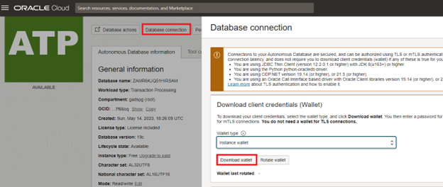
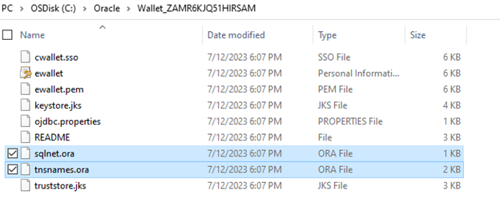

# How to connect to Oracle Autonomous Database using SQL*Plus?

Duration: 10 minutes

Oracle Autonomous Database provides autonomous data management in the cloud, and it takes care of routine maintenance tasks such as auto upgrades, patching and tuning. Autonomous databases offer scalability, high availability, security for different types of workloads. 

Oracle Autonomous database supports both TLS authentication and Mutual TLS Authentication. To connect to Autonomous Database, you should already have Oracle Cloud account and Database.  

## connect to Oracle Autonomous Database using SQL*Plus?

1.	Install Latest Oracle Client or Oracle Instant Client software on the client machine you want to connect to Oracle Autonomous database using SQL*Plus 

	You can download latest Oracle Instant Client from below URL 
	https://www.oracle.com/cis/database/technologies/instant-client/downloads.html

2.	Sign-in into Oracle Cloud Account using credentials (URL: https://cloud.oracle.com/)

3. Open the “Navigation” Menu and click on “Oracle Database”, select “Autonomous Database.”


4. Select the Autonomous Database that you want to connect using SQL*Plus and Select “Database Connection” and click on “Download wallet”. It will ask you to create password for the wallet. 



5. Unzip and copy the Wallet into a secure location on the client machine. 



6. Copy the sqlnet.ora and tnsnames.ora into %ORACLE_CLIENT%\network\admin location.

7. Edit sqlnet.ora file and replace "?/network/admin" with name of the folder where wallet has copied and save the file.

	WALLET_LOCATION = (SOURCE = (METHOD = file) (METHOD_DATA = (DIRECTORY="?/network/admin")))
	SSL_SERVER_DN_MATCH=yes

	After replace

	WALLET_LOCATION = (SOURCE = (METHOD = file) (METHOD_DATA = (DIRECTORY=C:\Oracle\Wallet_ZAMR6KJQ51HIRSAM)))
	SSL_SERVER_DN_MATCH=yes


8. Test the Oracle service can be successfully reached using tnsping utility.

	```
	<copy>
	C:\>tnsping zamr6kjq51hirsam_high
	</copy>
	
	TNS Ping Utility for 64-bit Windows: Version 19.0.0.0.0 - Production on 12-JUL-2023 18:22:13

	Copyright (c) 1997, 2019, Oracle.  All rights reserved.

	Used parameter files:
	C:\Oracle\client_1\network\admin\sqlnet.ora

	Used TNSNAMES adapter to resolve the alias
	Attempting to contact (description= (retry_count=20)(retry_delay=3)(address=(protocol=tcps)(port=1522)(host=adb.us-sanjose-1.oraclecloud.com))(connect_data=(service_name=e3498397f869g99e1_zamr6kjq51hirsam_high.adb.oraclecloud.com))(security=(ssl_server_dn_match=yes)))
	OK (2640 msec)
	```

9. You should be able to connect Oracle Autonomous database using SQL*Plus with credentials and service name provided in the tnsnames.ora file.
	For ex: sqlplus username/password@connect_string

	```
	<copy>
	C:\> sqlplus admin/password@zamr6kjq51hirsam_high
	</copy>
	```

## Learn More

* [Connect to Autonomous Database Using Oracle Database Tools](https://docs.oracle.com/en/cloud/paas/autonomous-database/adbsa/connect-tools.html#GUID-CF6C7E1B-D0D4-4641-BADA-5C57DEA7C73B)
* [Oracle Autonomous Database Documentation](https://docs.oracle.com/en/cloud/paas/autonomous-database/shared/index.html)
* [Oracle Autonomous Database Reference](https://www.oracleracexpert.com/search/label/Autonomous%20Database)
* [Autonomous Database](https://www.oracle.com/autonomous-database/)

## Acknowledgements

* **Author** - Satishbabu Gunukula, Oracle ACE Pro
* **Last Updated By/Date** - Satishbabu Gunukula,  Sept 2023
