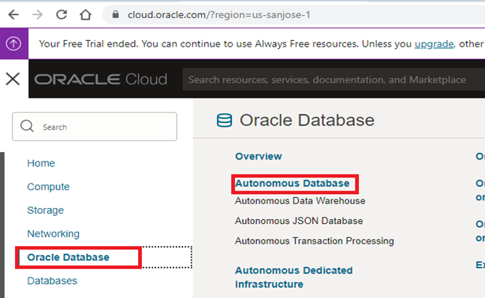
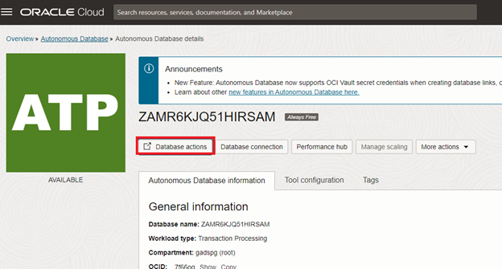
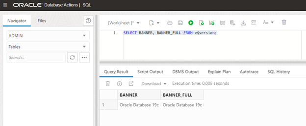
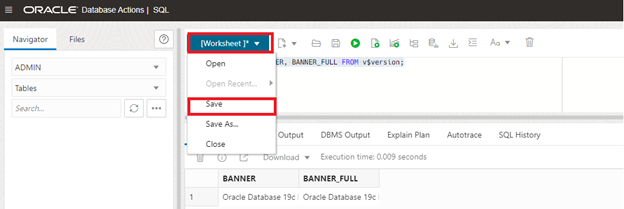

# How do I connect to the Oracle Autonomous Database and execute queries and scripts?

Duration: 5 minutes

## Execute Queries in  SQL Query Window using Database Actions

Oracle Autonomous Database provides Database Actions web interface for users to provide development, Data Studio, Administration, Downloads and Monitoring. The main features under development are to execute queries and scripts, browse and manage database objects, load data, optimize queries…etc   The Database actions available for on-premises or Oracle Database cloud services. 

To execute the SQL Statements and scripts in the Oracle Autonomous Database, you should already have an Oracle Cloud account and Database.

1.	Sign-in into Oracle Cloud Account using credentials (URL: https://cloud.oracle.com/)

2.	Open the “Navigation” Menu and click on “Oracle Database”, select “Autonomous Database.”

3.  Select the Autonomous Database that you want to connect click “Database Actions” to launch. 

4.  Under Development, click “SQL” to launch work SQL Query window to execute the queries and scripts.

5. 	You can save the worksheet by clicking “Save”  and provide a Name and select “Device” where you want to save.

## Learn More

* [Connect to Autonomous Database Using Oracle Database Tools](https://docs.oracle.com/en/cloud/paas/autonomous-database/adbsa/connect-tools.html#GUID-CF6C7E1B-D0D4-4641-BADA-5C57DEA7C73B)
* [Oracle Autonomous Database Documentation](https://docs.oracle.com/en/cloud/paas/autonomous-database/shared/index.html)
* [Oracle Autonomous Database Reference](https://www.oracleracexpert.com/search/label/Autonomous%20Database)
* [Autonomous Database](https://www.oracle.com/autonomous-database/)

## Acknowledgements

* **Author** - Satishbabu Gunukula, Oracle ACE Pro
* **Last Updated By/Date** - Satishbabu Gunukula,  Sept 2023
