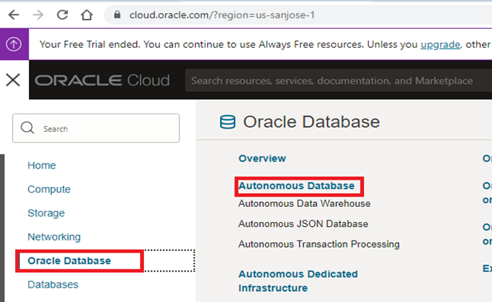
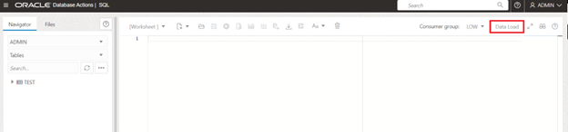
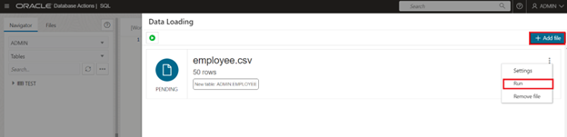
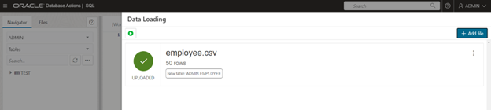
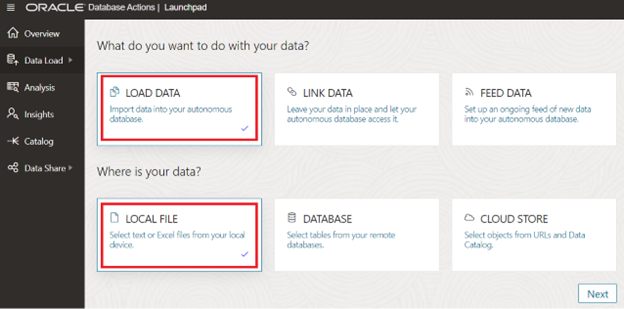
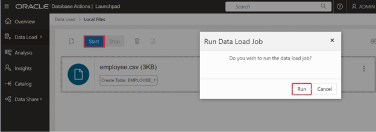
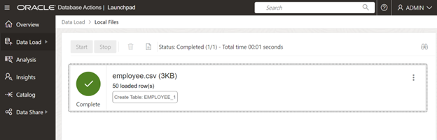

# How do I load data into Oracle Autonomous Database from local files?

Duration: 12-15 minutes

## Load Data into Oracle Autonomous Database

Oracle Autonomous Database provides Database Actions web interface for users to provide development, Data Studio, Administration, Downloads and Monitoring. 
You can load data into Oracle Autonomous Database using “SQL” under development or “Data Load” under “Data Studio” interface.

There are two different ways of loading data into Oracle Autonomous Database 

1. Load Data using SQL Worksheet
2. Load data using Data Studio 

To Load data into Oracle Autonomous Database, you should already have an Oracle Cloud account and Database.  

## Load Data using SQL Worksheet
In this method you will be using "SQL Worksheet" under development to load data into Oracle Autonomous Database

1.	Sign-in into Oracle Cloud Account using credentials (URL: https://cloud.oracle.com/)

2.	Open the “Navigation” Menu and click on “Oracle Database”, select “Autonomous Database.”

3.  Select the Autonomous Database that you want to connect, click “Database Actions” drop-down. 
    

4. Select “SQL” to launch SQL Worksheet window 
    

5.	In SQL Worksheet window and Click on “Data Load” to load data 
    

    Click on “Add file” to select the file you want to load and “Run” to load data.
    

    The data should be loaded successfully. In case if the table doesn’t exist, it will create the table with appropriate data types.
    

## Load data using Data Studio 
In this method you will be using  Data Studio to load data into Oracle Autonomous Database

1.	Sign-in into Oracle Cloud Account using credentials (URL: https://cloud.oracle.com/)

2.	Open the “Navigation” Menu and click on “Oracle Database”, select “Autonomous Database.”

3.  Select the Autonomous Database that you want to connect, click “Database Actions” drop-down. 
    

4. Select "DATA LOAD" to load data from local files or remote databases
    

5.	A new page will be where you will select "LOAD DATA" and the data location. 

    
    
    In the Next screen “Select files” or “Drag and drop here to upload”. Click on “Start” and “Run” Data load job.
    

    The data should be loaded successfully. In case if the table doesn’t exist, it will create the table with appropriate data types.
    

## Learn More

* [Connect to Autonomous Database Using Oracle Database Tools](https://docs.oracle.com/en/cloud/paas/autonomous-database/adbsa/connect-tools.html#GUID-CF6C7E1B-D0D4-4641-BADA-5C57DEA7C73B)
* [Oracle Autonomous Database Documentation](https://docs.oracle.com/en/cloud/paas/autonomous-database/shared/index.html)
* [Oracle Autonomous Database Reference](https://www.oracleracexpert.com/search/label/Autonomous%20Database)
* [Autonomous Database](https://www.oracle.com/autonomous-database/)

## Acknowledgements

* **Author** - Satishbabu Gunukula, Oracle ACE Pro
* **Last Updated By/Date** - Satishbabu Gunukula,  Oct 2023
