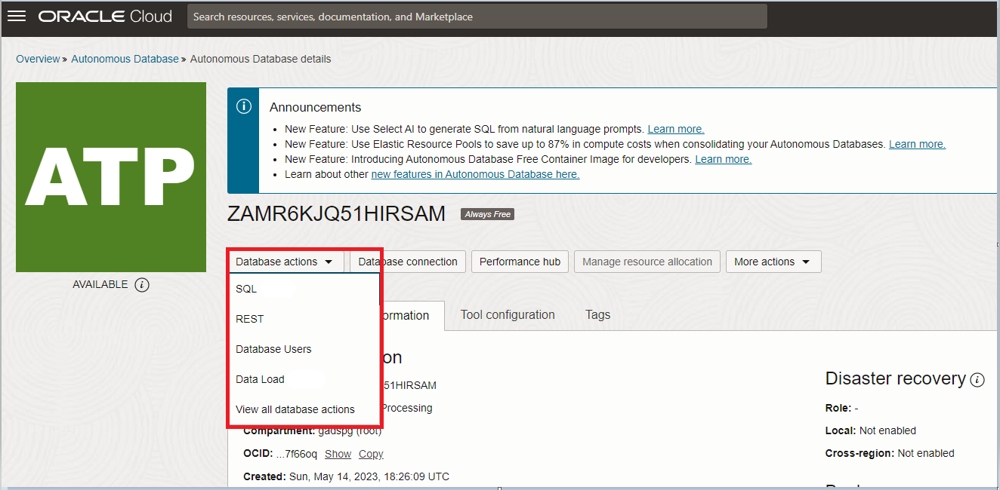
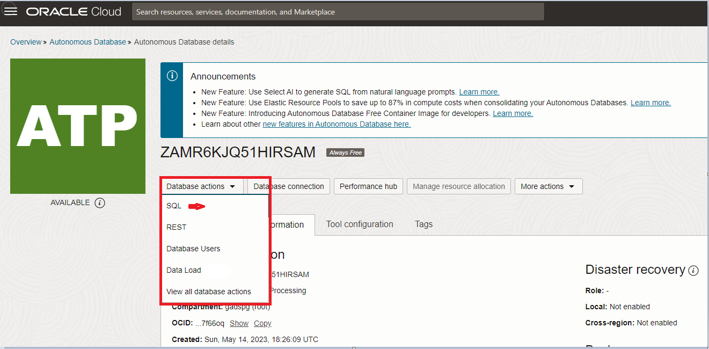

# How do I load data into Oracle Autonomous Database?

Duration: 10 minutes

## Load Data into Oracle Autonomous Database

Oracle Autonomous Database provides Database Actions web interface for users to provide development, Data Studio, Administration, Downloads and Monitoring. You can load data into Oracle Autonomous Database using “SQL” under development or “Data Load” under “Data Studio” interface.

To Load data into Oracle Autonomous Database, you should already have an Oracle Cloud account and Database.  

1.	Sign-in into Oracle Cloud Account using credentials (URL: https://cloud.oracle.com/)

2.	Open the “Navigation” Menu and click on “Oracle Database”, select “Autonomous Database.”

3.  Select the Autonomous Database that you want to connect click “Database Actions” to launch. 

4. Under Development, click “SQL” to launch work SQL Query window to load data or Click “DATALOAD” to load data from local files or remote databases. 

5.	Data Load using SQL under Development: Launch “SQL” Query window and Click on “Data Load”

Click on “Add file” to select the file you want to load and “Run” to load data. 

The data should be loaded successfully. In case if the table doesn’t exist, it will create the table with appropriate data types.

6.	Data Load using “Data Load” under Data Studio: Launch “DataLoad” and select the data location. 

In the Next screen “Select files” or “Drag and drop here to upload”. Click on “Start” and “Run” Data load job. 

The data should be loaded successfully. In case if the table doesn’t exist, it will create the table with appropriate data types.

## Learn More

* [Connect to Autonomous Database Using Oracle Database Tools](https://docs.oracle.com/en/cloud/paas/autonomous-database/adbsa/connect-tools.html#GUID-CF6C7E1B-D0D4-4641-BADA-5C57DEA7C73B)
* [Oracle Autonomous Database Documentation](https://docs.oracle.com/en/cloud/paas/autonomous-database/shared/index.html)
* [Oracle Autonomous Database Reference](https://www.oracleracexpert.com/search/label/Autonomous%20Database)
* [Autonomous Database](https://www.oracle.com/autonomous-database/)

## Acknowledgements

* **Author** - Satishbabu Gunukula, Oracle ACE Pro
* **Last Updated By/Date** - Satishbabu Gunukula,  Sept 2023
