# Create a Document Management Application

## Introduction

This lab puts theory into practice by having you create a very basic Oracle APEX application for managing documents and their metadata in a database.

Estimated Time: 60 minutes

Watch the video below for a quick walk-through of the lab.

[Lab 3: Create a Document Management Application](videohub:1_bftobu31)

### About <Product/Technology>

Oracle APEX is a low-code software development platform that is included with every Oracle *Autonomous Database* (ADB) provisioned. The *Oracle Cloud Infrastructure* (OCI) REST API will be used by the platform's `APEX_WEB_SERVICE` PL/SQL package to interface with the OCI *Object Storage Service* (OSS). It is worthwhile to note that on ADB's, in addition to the prescribe approach, one can also work with the OSS using either the [OCI PL/SQL software development kit](https://docs.oracle.com/iaas/Content/API/SDKDocs/plsqlsdk.htm) (SDK) or the [DBMS_CLOUD](https://docs.oracle.com/en/cloud/paas/autonomous-database/adbsa/dbms-cloud-subprograms.html) PL/SQL package.

### Objectives

In this lab, you will:

* Create an Oracle APEX application.
* Configure a Web Credentials.
* Create pages to:
	* List all documents in the Object Storage bucket.
	* Create a new document record and uploading the associated file to the bucket.
	* Update an existing document record, uploading and replacing the associated file in the bucket.
	* Delete an existing document record and removing the associated file from the bucket.
* Implement functionality to allow application users to download or render the uploaded files.

### Prerequisites

This lab assumes that you have:

* The necessary privileges to create the resources in this lab.
* Created the required OCI resources.
* Created the Oracle APEX workspace, Oracle Database schema, and a developer or workspace administrator account.
* Some experience developing Oracle APEX applications.

## Task 1: Create a New Oracle APEX Application

1. After successful login to the workspace, click on the *App Builder* icon.

1. Click the *Create* icon.

1. Click the card item *New Application*.

1. Enter the desired application name, and then click the button *Create Application*.

1. Once the application has been created successfully, you will be redirected to the applications's home page.
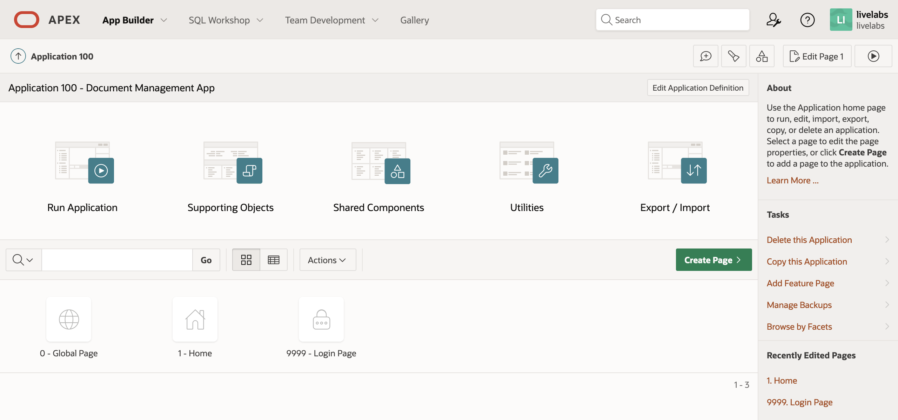

## Task 2: Setup a Workspace Web Credential

> **IMPORTANT - Supported Versions**
>
> Working with OCI REST APIs requires clients to [sign requests](https://docs.oracle.com/iaas/Content/API/Concepts/signingrequests.htm). From Oracle APEX 19.2, using the Oracle APEX Web Credential's OCI authentication type makes this process transparent.

1. Back on the App Builder home page, click on the *Workspace Utilities* icon.

1. Click on the link *Web Credentials*.

1. Click the button *Create*.

1. Select the authentication type *Oracle Cloud Infrastructure (OCI)*, and then enter the information from Lab 1, Task 5, when an API key was generated for the *Identity and Access Management* (IAM) user that will interact with the OCI REST APIs on the application's behalf. The required information are the tenancy [Oracle Cloud ID](https://docs.oracle.com/iaas/Content/General/Concepts/identifiers.htm) (OCID), user OCID, fingerprint of the user's API public key, and the user's API private key. Then, click the *Create* button.

1. Unless specified, the web credential's *Static Identifier* is derived from its name.


## Task 3: Create Substitution Strings

1. From the Application home page, go to the application definition by clicking the button *Edit Application Definition*, close to the top-right of the page.

1. Click on the *Substitutions* tab and then create the **four** *Substitution Strings* listed below the screenshot.
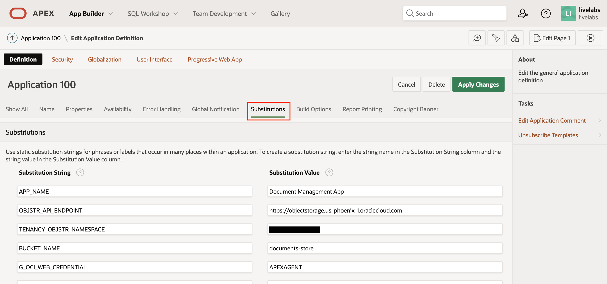
	* **`OBJSTR_API_ENDPOINT`** - the Object Storage endpoint varies with the region associated with your bucket. You can obtain the appropriate value from this [page](https://docs.oracle.com/iaas/api/#/en/objectstorage/20160918/).
	* **`TENANCY_OBJSTR_NAMESPACE`** - see the next task item if you do not know what value to enter here.
	* **`BUCKET_NAME`** - the name of the target bucket where the documents will be uploaded to.
	* **`G_OCI_WEB_CREDENTIAL`** - the *Static Identifier* of the web credential created in Task 2.
1. If you are unsure of what the value of `TENANCY_OBJSTR_NAMESPACE` should be, then go to the OCI Console, click on the navigation menu, select *Governance & Administration*, and click *Tenancy Details*.
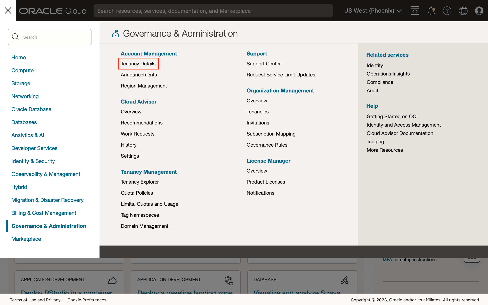
1. Under the *Tenancy Information*, use the value of the *Object storage namespace* field.
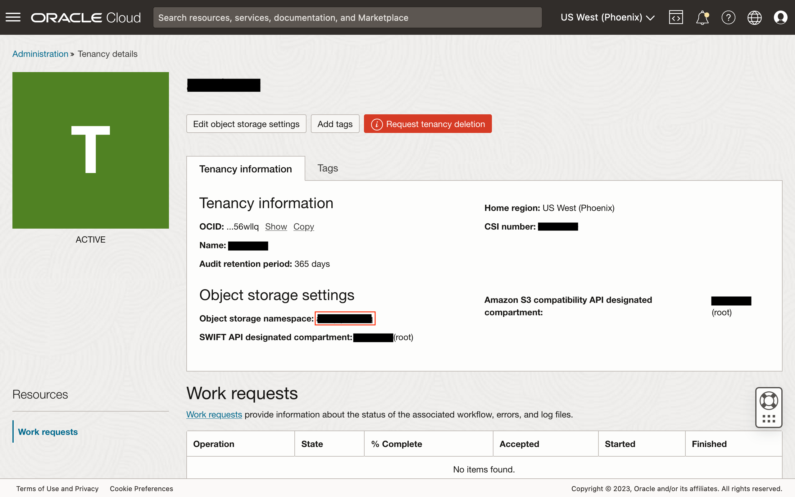
1. Once all the substitution string values have been entered, click the button *Apply Changes*.


## Task 4: Create Database Objects

1. Go to the *SQL Workshop* and access the *SQL Commands* utility to run

1. Copy the following SQL code:
	```sql
	<copy>
	create table document (
		document_id number generated always as identity
		, document_name varchar2(200) not null
		, description varchar2(32767)
		, filename varchar2(400)
		, mime_type varchar2(255)
		, object_name varchar2(1024) not null
		, created_by varchar2(30)
		, created_on timestamp with local time zone
		, updated_by varchar2(30)
		, updated_on timestamp with local time zone
		, constraint document_pk primary key (document_id)
	)
	/
	</copy>
	```
1. Paste the copied code and then execute the SQL statement by clicking the button *Run*.
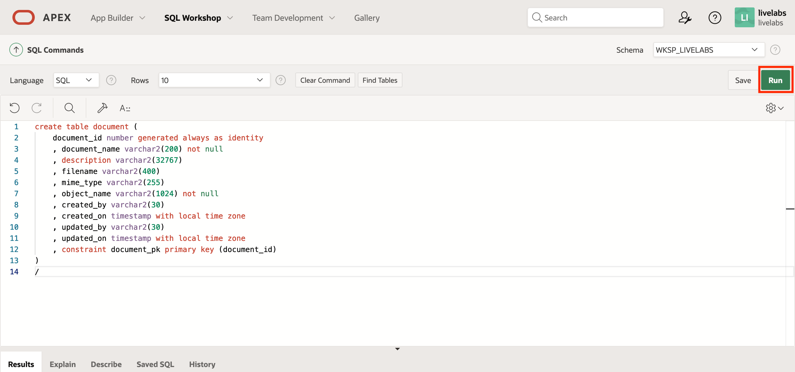
1. Similarly, execute the following code to create the database trigger `document_biu`:
	```sql
	<copy>
	create or replace trigger document_biu
	before insert or update on document
	for each row
	declare
	begin
		if inserting then
			:new.created_by := coalesce(sys_context('APEX$SESSION','APP_USER'), user);
			:new.created_on := localtimestamp;
		else
			:new.updated_by := coalesce(sys_context('APEX$SESSION','APP_USER'), user);
			:new.updated_on := localtimestamp;
		end if;
	end;
	/
	</copy>
	```

> **Note:** You may also execute these statements using your favorite Oracle
> Database client tool such as SQLcl, SQL*Plus, SQL Developer, or Database Actions.

## Task 5: Create a Page for Creating New or Modifying Existing Documents

1. From the application's home page, click the button *Create Page*.

1. In the modal page, click the icon *Blank Page*. The wizard should progress to the next step, if not, click the button *Next*.
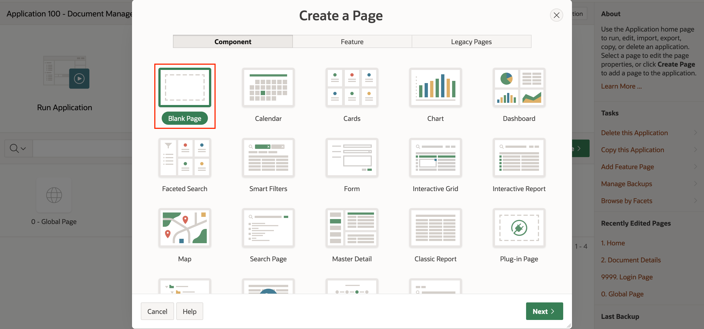
1. Enter *2* for the page number, and then *Document Details* for the page name. Leave the page mode set to *Normal*. Expand the hidden region *Navigation* to expose additional settings for the new page. First, select *Home (Page 1)* for the breadcrumb's parent entry, and then turn off navigation thereby not including a link to the new page on the application's side navigation menu.

1. Create a new region of type *Form*. Set the source to:
	* **Location** - *Local Database*
	* **Type** - *Table / View*
	* **Table Owner** - *Parsing Schema*
	* **Table Name** - *DOCUMENT*
1. Oracle APEX will automatically populate the region with page items for each column in the table `DOCUMENT`. Prune the items leaving only the items listed in the table below, and change the page item types accordingly.
| Name               | Type           | Required? (Y/N) | Additional Notes                                |
| ------------------ | -------------- | --------------- | ----------------------------------------------- |
| `P2_DOCUMENT_ID`   | Hidden         | Not applicable  | Ensure a checksum is required.                  |
| `P2_DOCUMENT_NAME` | Text Field     | Y               |                                                 |
| `P2_DESCRIPTION`   | Textarea       | N               |                                                 |
| `P2_FILENAME`      | Hidden         | Not applicable  |                                                 |
| `P2_MIME_TYPE`     | Hidden         | Not applicable  |                                                 |
| `P2_OBJECT_NAME`   | Hidden         | Not applicable  |                                                 |
| `P2_FILE`          | File Browse... | N               | See the next task item for additional settings. |
{: title="Page Item Configurations"}

1. The page item `P2_FILE` is not generated by Oracle APEX and has to be added after configuring the Form region. After setting its page item type, set the following attributes:
	* **Display As** - *Block Dropzone*
	* **Storage Type** - *`Table APEX_APPLICATION_TEMP_FILES`*
	* **Purge File at** - *End of Request*
	* **Allow Multiple Files** - *Toggle off*
1. Next, add two buttons. *Optionally, add a "Cancel" button that returns the user back to the home page.*
| Name   | Template | Hot (Y/N) | Region   | Position | Action      | Execute<br>Validations (Y/N) | Server-side<br>Condition                  |
| ------ | -------- | --------- | -------- | -------- | ----------- | ------------------------- | -------------------------------------- |
| SAVE   | Text     | Y         | Document | Change   | Submit Page | Y                         | When item `P2_DOCUMENT_ID` is not NULL |
| CREATE | Text     | Y         | Document | Create   | Submit Page | Y                         | When item `P2_DOCUMENT_ID` is NULL     |
{: title="Button Configurations"}

1. The resulting page should look somewhat like this:

1. Create a page process named *saveDocument* of type *Execute Code*, and enter the following PL/SQL code in the source:
	```sql
	<copy>
	declare
		l_document_id document.document_id%type := :P2_DOCUMENT_ID;
		l_object_name document.object_name%type := :P2_OBJECT_NAME;
		l_request_url varchar2(32767);
		l_response clob;

		update_failed_exception exception;
		upload_failed_exception exception;
	begin
		if :REQUEST = 'CREATE' then
			l_object_name := 'D' || sys_guid() || '.bin';

			insert into document (document_name, description, object_name)
			values (:P2_DOCUMENT_NAME, :P2_DESCRIPTION, l_object_name)
			returning document_id into l_document_id;
		else
			if l_document_id is null then
				raise update_failed_exception;
			end if;

			update document
			set
				document_name = :P2_DOCUMENT_NAME
				, description = :P2_DESCRIPTION
			where document_id = l_document_id;
		end if;

		for file in (
			select * from apex_application_temp_files
			where name = :P2_FILE
		) loop
			update document
			set filename = file.filename
				, mime_type = file.mime_type
			where document_id = l_document_id;

			l_request_url :=
				:OBJSTR_API_ENDPOINT
				|| '/n/' || :TENANCY_OBJSTR_NAMESPACE
				|| '/b/' || :BUCKET_NAME
				|| '/o/' || apex_util.url_encode(l_object_name);

			apex_web_service.g_request_headers(1).name := 'Content-Type';
			apex_web_service.g_request_headers(1).value := file.mime_type;

			l_response := apex_web_service.make_rest_request(
				p_url => l_request_url
				, p_http_method => 'PUT'
				, p_body_blob => file.blob_content
				, p_credential_static_id => :G_OCI_WEB_CREDENTIAL
			);

			if apex_web_service.g_status_code != 200 then
				raise upload_failed_exception;
			end if;
		end loop;
	end;
	</copy>
	```
1. Validate the code by click the tick icon in the toolbar, and if successful, click the button *OK*.

1. Set an informative success and error message, and the following server-side condition:
	* **When Button Pressed** - *None selected*
	* **Type** - *Request is contained in Value*
	* **Value** - `CREATE,SAVE`
1. Create a branch to redirect the user back to the home page (page 1).
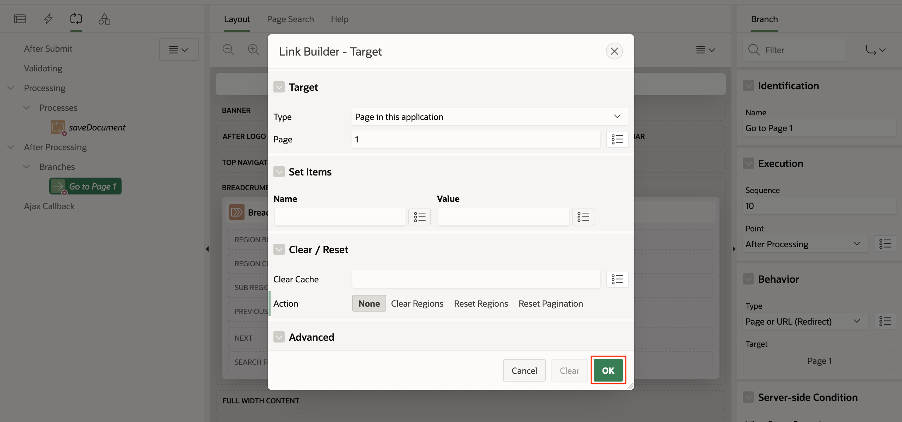
	* **Name** - Go to Page 1
	* **Target**
		* **Type** - *Page in this application*
		* **Page** - 1
	* **Server-side Condition**
		* **Type** - *Request is contained in Value*
		* **Value** - `CREATE,SAVE`

1. Finally, click the button *Save* to save all changes to this page.


## Task 6: Create a Report to List Documents

1. Edit Page 1, the Oracle APEX application's home page.
1. Create a new *Interactive Report* (IR) region using the following SQL query:
	```sql
	<copy>
	select
	document_id
	, document_name
	, description
	, filename
	, mime_type
	, nvl2(updated_by, updated_by, created_by) as last_modified_by
	, nvl2(updated_on, updated_on, created_on) as last_modified_on
	from document
	</copy>
	```
1. Configure the columns according to the table below:
| Name               | Type          |
| ------------------ | ------------- |
| `DOCUMENT_ID`      | Hidden Column |
| `DOCUMENT_NAME`    | Plain Text    |
| `DESCRIPTION`      | Plain Text    |
| `FILENAME`         | Plain Text    |
| `MIME_TYPE`        | Plain Text    |
| `LAST_MODIFIED_BY` | Plain Text    |
| `LAST_MODIFIED_ON` | Plain Text    |
{: title="Interactive Report Column Configurations"}

1. Under the IR's attributes, add a *Link Column" to with a *Link to Custom Target*.

	* **Type** - *Page in this application*
	* **Page** - *2*
	* **Set Items**
		* **Item 1**:
			* **NAME** - `P2_DOCUMENT_ID`
			* **VALUE** - `#DOCUMENT_ID#`
	* **Clear Cache** - *2*
	* **Action** - *None*
1. For the *Link Icon*, set it to the following HTML element:
	```html
	<copy>
	<span class="fa fa-file-edit" aria-hidden="true"></span>
	</copy>
	```
1. Next, add a button to create a new document.
	* **Identification:**
		* **Button Name** - `NEW_DOCUMENT`
		* **Label** - *New Document*
	* **Layout:**
		* **Region** - *Documents*
		* **Position** - *Right of Interactive Report Search Bar*
	* **Appearance:**
		* **Button Template** - *Text*
		* **Hot** - *Enabled*
	* **Behavior:**
		* **Action** - *Redirect to Page in this Application*
		* **Target**
			* **Page** - *2*
			* **Set Items** - *None*
			* **Clear Cache** - *2*
			* **Action** - *None*
1. Finally, click the button *Save* to persists all changes.


## Task 7: Update the Page to Delete Documents

1. Edit page 2, the *Document Details* page.
1. Add a new button with the following attributes:
	* **Identification:**
		* **Button Name** - `DELETE`
		* **Label** - *Delete*
	* **Layout:**
		* **Region** - *Document*
		* **Position** - *Delete*
	* **Appearance:**
		* **Button Template** - *Text*
		* **Hot** - *Disabled*
	* **Behavior:**
		* **Action** - *Submit Page*
		* **Execute Validations** - *Disabled*
		* **Requires Confirmation** - *Enabled*
	* **Confirmation:**
		* **Message** - `Are you sure that you want to delete the document "&P2_DOCUMENT_NAME."?`
		* **Style** - *Warning*
	* **Server-side Condition:**
		* **Type** - *Item is NOT NULL*
		* **Item** - `P2_DOCUMENT_ID`
1. Create a page process named *deleteDocument* of type *Execute Code*, and enter the following PL/SQL code in the source:
	```sql
	<copy>
	declare
		l_request_url varchar2(32767);
		l_response clob;

		delete_failed_exception exception;
	begin
		delete from document where document_id = :P2_DOCUMENT_ID;

		l_request_url :=
			:OBJSTR_API_ENDPOINT
			|| '/n/' || :TENANCY_OBJSTR_NAMESPACE
			|| '/b/' || :BUCKET_NAME
			|| '/o/' || apex_util.url_encode(:P2_OBJECT_NAME);

		l_response := apex_web_service.make_rest_request(
			p_url => l_request_url
			, p_http_method => 'DELETE'
			, p_credential_static_id => :G_OCI_WEB_CREDENTIAL
		);

		if apex_web_service.g_status_code != 204 then
			raise delete_failed_exception;
		end if;
	end;
	</copy>
	```
1. Validate the code by click the tick icon in the toolbar, and if successful, click the button *OK*.

1. Set an informative success and error message, and the following server-side condition:
	* **When Button Pressed** - `DELETE`
	* **Type** - *None selected*
1. Update the server-side condition for the *Go to Page 1* branch. The new value should be: `CREATE,SAVE,DELETE`.
1. Click the button *Save* to persist all the changes made.

## Task 8: Download a Document

As the documents are uploaded to a private Object Storage bucket, the file cannot be accessed directly by the user's browser. Hence, in this task, we will create an *Application Item* and on-demand *Application Process* that will allow Oracle APEX to retrieve the object on the user's behalf.

1. From the application home page, go to the *Shared Components*.
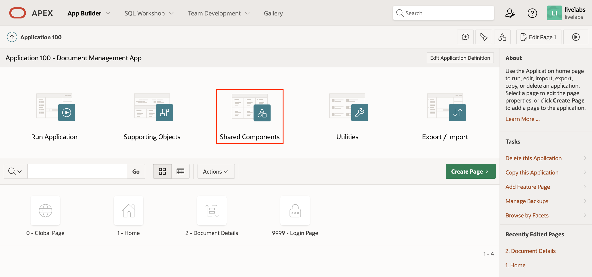
1. Click the link *Application Items*.
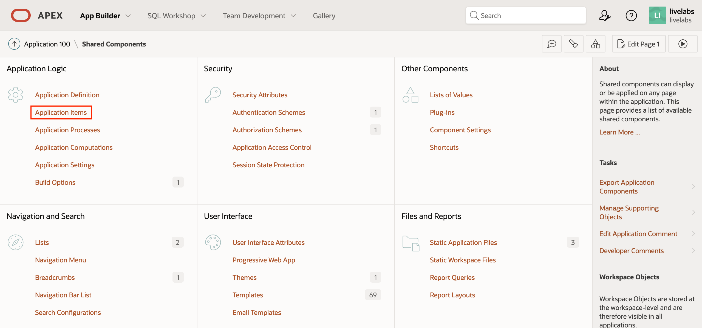
1. Click the button *Create*.

1. Enter the attributes of the application item `APP_DOCUMENT_ID`, and then click the button *Create Application Item*.

	* **Name** - `APP_DOCUMENT_ID`
	* **Scope** - *Application*
	* **Session State Protection** - *Checksum Required - Session Level*
	* **Escape Special Characters** - *Enabled*
1. Return to the *Shared Components* page, but this time, click on the link *Application Processes* instead.

1. Click the button *Create*.

1. Enter the attributes of the application process `DOWNLOAD_OBJECT`, and then click the button *Next*.
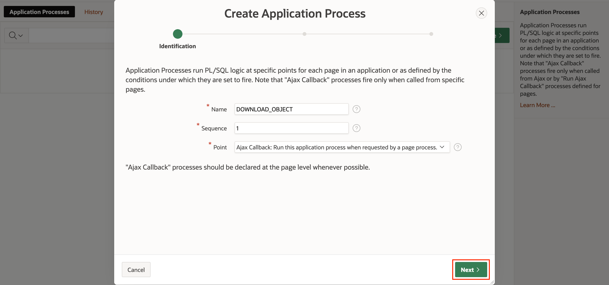
	* **Name** - `DOWNLOAD_OBJECT`
	* **Sequence** - *1*
	* **Point** - *Ajax Callback: Run this application process when requested by a page process.*
1. In the next step, enter the following PL/SQL procedure for the application process' source:
	```sql
	<copy>
	declare
		l_request_url varchar2(32767);
		l_content_type varchar2(32767);
		l_content_length varchar2(32767);

		l_response blob;

		download_failed_exception exception;
	begin
		for document in (
			select object_name, filename, mime_type
			from document
			where document_id = :APP_DOCUMENT_ID
		) loop
			l_content_type := document.mime_type;

			l_request_url :=
				:OBJSTR_API_ENDPOINT
				|| '/n/' || :TENANCY_OBJSTR_NAMESPACE
				|| '/b/' || :BUCKET_NAME
				|| '/o/' || apex_util.url_encode(document.object_name);

			l_response := apex_web_service.make_rest_request_b(
				p_url => l_request_url
				, p_http_method => 'GET'
				, p_credential_static_id => :G_OCI_WEB_CREDENTIAL
			);

			if apex_web_service.g_status_code != 200 then
				raise download_failed_exception;
			end if;

			for i in 1..apex_web_service.g_headers.count
			loop
				if apex_web_service.g_headers(i).name = 'Content-Length' then
					l_content_length := apex_web_service.g_headers(i).value;
				end if;

				if apex_web_service.g_headers(i).name = 'Content-Type' then
					l_content_type := apex_web_service.g_headers(i).value;
				end if;
			end loop;

			sys.htp.init;
			if l_content_type is not null then
				sys.owa_util.mime_header(trim(l_content_type), false);
			end if;
			sys.htp.p('Content-length: ' || l_content_length);
			sys.htp.p('Content-Disposition: attachment; filename="'
				|| document.filename || '"' );
			sys.owa_util.http_header_close;
			sys.wpg_docload.download_file(l_response);
		end loop;
	end;
	</copy>
	```
1. Click the button *Next* to proceed.
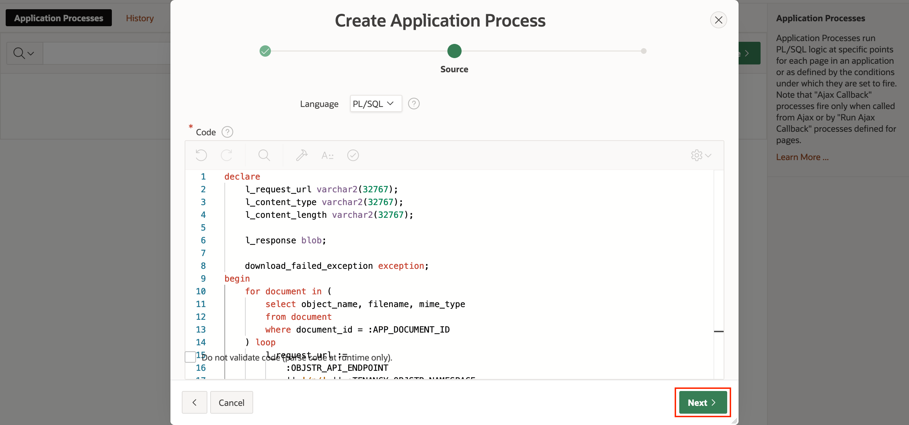
1. Restrict access to the application process by ensuring that the *Condition Type* is set to *User is Authenticated (not public)*, then click the button *Create Process* to complete and end the wizard.
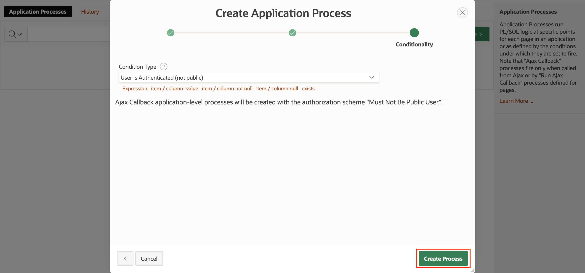
1. Return to edit Page 1.
1. Modify the IR column `FILENAME` in the *Documents* region to display as a link.
1. The *Link Text* should be set to `#FILENAME#`.
1. For the *Target*, set it to the specified values below, and then click the button *OK*.
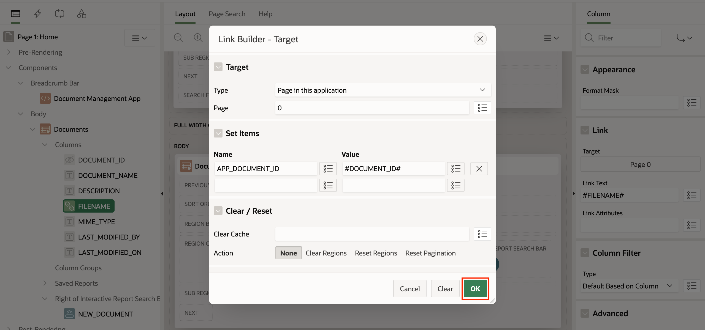
	* **Type** - *Page in this application*
	* **Page** - *0*
	* **Set items**
		* **Item 1:**
			* **Name** - `APP_DOCUMENT_ID`
			* **Value** - `#DOCUMENT_ID#`
	* **Request (under the Advanced section)** - `APPLICATION_PROCESS=DOWNLOAD_OBJECT`
1. Click the button *Save* to apply all changes.

> **Note:** Another approach for downloading files is to generate a [pre-authenticated request](https://docs.oracle.com/iaas/Content/Object/Tasks/usingpreauthenticatedrequests.htm) (PAR) that will allow users to access the objects directly from the Object Storage.

## Task 9: Run the Application

In this final task, we will run the Oracle APEX application and validate the functionalities that were created in the preceding tasks.

1. On the application's home page, click the *Run Application* icon.

1. Login using a valid *Oracle APEX Account*.

1. On the Oracle APEX application's home page, click the button *New Document*.

1. Enter a *Document Name* and optionally, a *Description*. Select a file or simply drag and drop it from your operating system, and then click the button *Create*.

1. Validate that both the database record was created, and a corresponding object was created in the target Object Storage bucket.

1. Back on the home page, click on the document's filename to download the file. Ensure that the file opens and contains the expected content.

1. Next, click the document's edit icon.

1. Attempt to change one or more fields, including the file binary, and then click the button *Save*.
1. Check that the modifications to the record were saved successfully.
1. Return to the *Document Details* page, and then this time, click the button *Delete*.

1. A modal dialog will present itself to confirm the action. Click the button *Delete*.

1. Validate that the record and file were deleted from the database and bucket respectively.

Congratulations! You have **completed** all the necessary labs and tasks.

## Acknowledgements

* **Author** - Adrian Png, Senior Cloud Solutions Architect, Insum Solutions Inc.
* **Last Updated By/Date** - Adrian Png, December 2022
