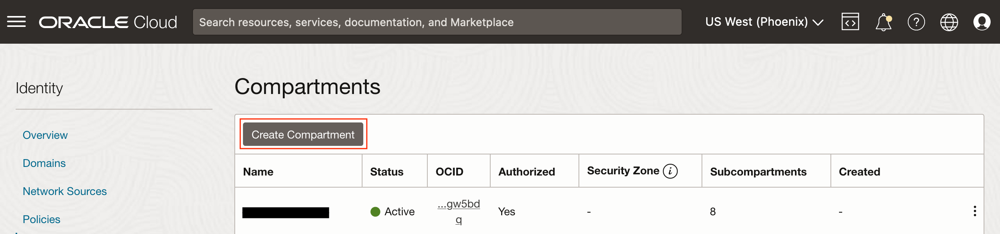
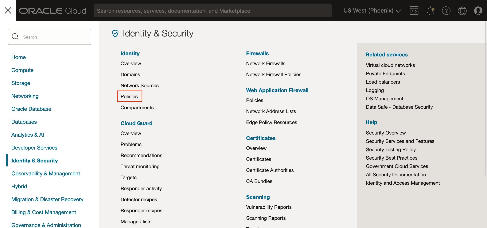
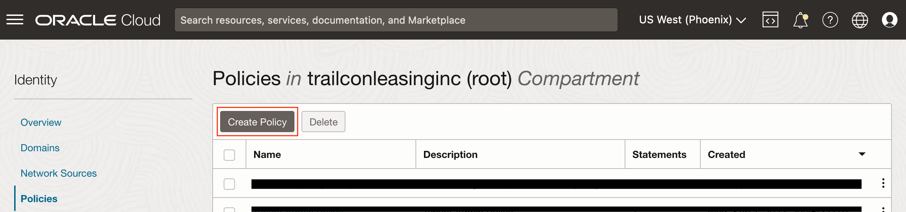
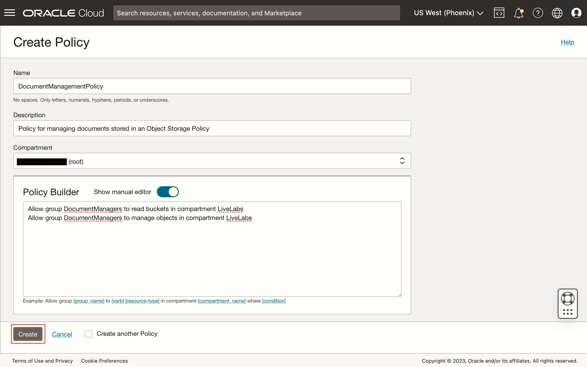
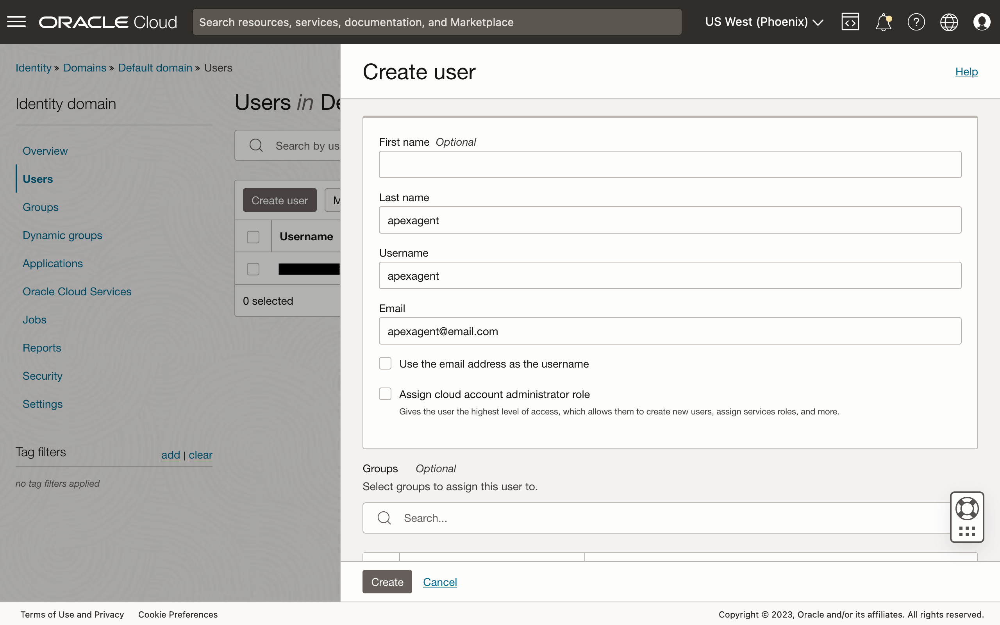
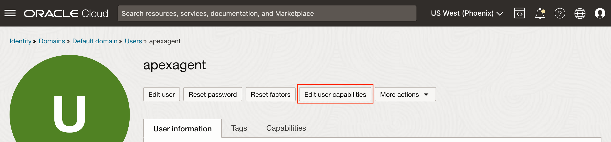
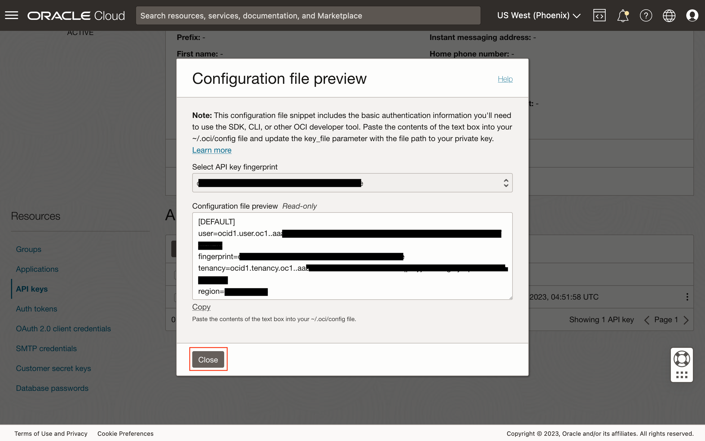

# Create OCI Identity and Access Management Resources

## Introduction

In this lab, we will create the required *Identity and Access Management* (IAM) resources that will be needed to support working with the Object Storage using the OCI REST APIs.

Estimated Time: 30 minutes

### About Identity and Access Management

The OCI IAM provides the necessary resources for managing user authentication, logically dividing resources into compartments, and managing authorizations using groups and policies. Tenancies today have access to IAM either with or without *Identity Domains*. The latter is the older version of IAM and on which this lab is based on.

### Objectives

In this lab, you will create the following IAM resources:

* A compartment for placing the Object Storage bucket.
* A group that is used in policy statements.
* A policy and its statements that define actions that members of a group may perform.
* A user that is used in applications to authenticate to the OCI REST APIs. Users are assigned to groups with the appropriate permissions.

## Task 1: Create a Compartment

1. Click the *navigation menu* (sometimes known as the "hamburger") button on the top left to show all the available menu items on the OCI Console.

1. Click the link *Identity & Security*, and then *Compartments*.

1. Click the *Create Compartment* button.

1. Enter the required details, the *Name* and *Description*, and optionally, select a *Parent Compartment*. Click the *Create Compartment* button to create the desired compartment.


## Task 2: Create a Group

1. Next, create an IAM group. Back on the *Compartments* page, under the *Identity* menu on the left, click the *Groups* link.

1. Click the *Create Group* button.

1. Create a group named *DocumentManagers* and enter an appropriate description. Click the *Create* button to create the group.

1. Once the group has been created, check the details, and then click the breadcrumb *Identity* on the top-left of the page in preparation for the next task.


## Task 3: Create a Policy

1. After the last task, you should be on the *Users* page. Again, under the *Identity* menu on the left, click the *Policies* link.

1. Click the *Create Policy* button.

1. Create a policy named *DocumentManagementPolicy* and enter an appropriate description. Select the "root" compartment where this resource will be created in. Next, switch the *Show manual editor* toggle to enable.

1. Enter the two statements below (tweak if necessary) and then click the *Create Policy* button.
	```text
	<copy>
	Allow group DocumentManagers to read buckets in compartment LiveLabs
	Allow group DocumentManagers to manage objects in compartment LiveLabs
	</copy>
	```


> **NOTE:**
>
> A more restrictive policy can be used to restrict which buckets the *DocumentManagers* group members can manage objects. Look up the OCI document for [details](https://docs.oracle.com/iaas/Content/Identity/Reference/objectstoragepolicyreference.htm) on how these policy statements can be further modified to restrict access.

## Task 4: Create a User

1. Return to the *Users* page on the OCI console and click the *Create User* button.

1. Select *IAM User* and enter a name and description for the user. Entering an email address is not necessary. Click the *Create* button to create the user.

1. On the user's details page, click the *Edit User Capabilities* button.

1. Uncheck all capabilities except *API Keys*, and then click the *Save Changes* button.

1. Back on the user's details page, scroll down and then under the *Resources* menu on the left, click the *Groups* link. Then, click the *Add User to Group* button.

1. Select the group created in Task 2, and then click the *Add* button.


## Task 5: Generate API Keys for the User to Call OCI REST APIs Securely

1. The final task in this lab is to generate an API key. Under the *Resources* menu, click the *API Keys* link, and then click the *Add API Key* button.

1. Select the *Generate API Key Pair* option to have the OCI Console generate the encryption key pair. Click the *Download Private Key* button to download the private key, and optionally, click the *Download Public Key* button to download its public counterpart. The latter can be generated from the private key later if required. Store the private key securely. Finally, click the *Add* button.

1. Once the key pair has been created, the OCI Console will display configuration information that can be added to the OCI [*Command Line Interface*](https://docs.oracle.com/iaas/Content/API/Concepts/cliconcepts.htm) (CLI) configuration file. The same information is required for creating the Oracle APEX *Web Credentials* later, so please not the values of the fields listed below the image.

	* **user** - The [Oracle Cloud ID](https://docs.oracle.com/iaas/Content/General/Concepts/identifiers.htm) (OCID) for the user.
	* **fingerprint** - The fingerprint of the API's public key.
	* **tenancy** - The OCID for the tenancy.

> **NOTE:**
>
> Here, the API keys were generated using the OCI Console. Other alternative ways to create the private and public keys is to use either the OCI CLI, or [OpenSSL](https://www.openssl.org) that is installed in most modern operating systems.

You may not **proceed to the next lab**.
