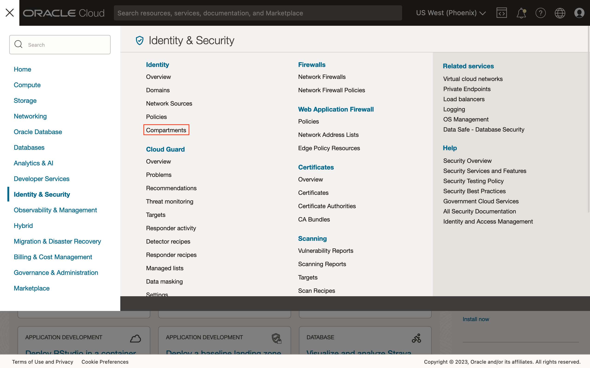
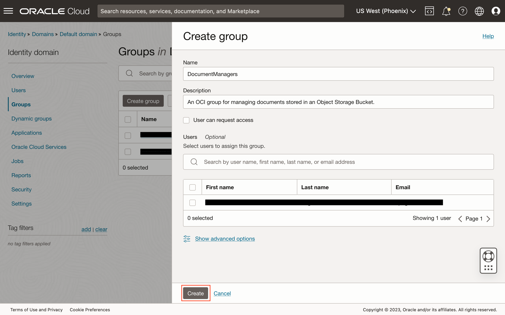
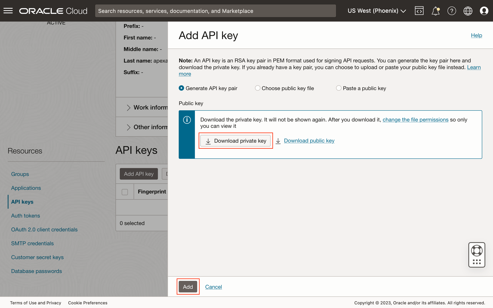

# Create OCI Identity and Access Management Resources

## Introduction

In this lab, we will create the required *Identity and Access Management* (IAM) resources that will be needed to support working with the Object Storage using the OCI REST APIs.

Estimated Time: 15 minutes

Watch the video below for a quick walk-through of the lab.

[Lab 1: Create OCI Identity and Access Management Resources](videohub:1_o6gtme7g)

### About Identity and Access Management

The OCI IAM provides the necessary resources for managing user authentication, logically dividing resources into compartments, and managing authorizations using groups and policies. Tenancies today have access to IAM either with or without *Identity Domains*. In this lab, we will provision the resources using identity domains.

### Objectives

In this lab, you will create the following IAM resources:

* A compartment for placing the Object Storage bucket.
* A group that is used in policy statements.
* A user that is used in applications to authenticate to the OCI REST APIs. Users are assigned to groups with the appropriate permissions.
* A policy and its statements that define actions that members of a group may perform.

### Prerequisites

This lab assumes that you have:

* Access to an Oracle Cloud tenancy.
* The necessary privileges to create the resources in this lab.
* Some familiarity with the OCI Console.

## Task 1: Create a Compartment

1. Click the *navigation menu* (sometimes known as the "hamburger") button on the top left to show all the available menu items on the OCI Console.

1. Click the link *Identity & Security*, and then *Compartments*.

1. Click the *Create Compartment* button.

1. Enter the required details, the *Name* and *Description*, and optionally, select a *Parent Compartment*. Click the *Create Compartment* button to create the desired compartment.


## Task 2: Create a Group

In tenancies provisioned with IAM using *identity domains*, users and groups are managed within domains. Such tenancies will have a *Default* domain created by default. We will create a new group in this task.

1. Access the navigation menu, and click the link *Identity & Security*. Under the *Identity* heading, click the link *Domains*.

1. Under the table of domains, click on the link to the *Default* domain. If you do not see the correct domain, on the left side of the page, check that the *root* compartment is selected.

1. On the left navigation menu, click the link *Groups*.

1. Click the *Create Group* button.

1. Create a group named *DocumentManagers* and enter an appropriate description. Click the *Create* button to create the group.

1. Validate that the group was created successfully.


## Task 3: Create a User

1. While on the group's details page, a the top, click on the breadcrumb link *Default domain*, to return to the domain's details page.

1. In the left navigation menu, click the link *Users*.

1. Click the *Create User* button.

1. At minimum, enter a *Last name* and the desired *Username*. Depending on domain's settings, an email address is required. If a different username is desired, uncheck the option *Use the email address as the username*, and then enter **both** the *Username* and *Email* fields.

1. Scroll down and assign the user to the group created in Task 1 by selecting the checkbox next to the desired group's name. Click the *Create* button to create the user.

1. On the user's details page, click the *Edit user capabilities* button.

1. Uncheck all capabilities except *API keys*, and then click the *Save changes* button.


## Task 4: Generate API Keys for the User to Call OCI REST APIs Securely

1. From the user's details page, under the *Resources* menu, click the *API keys* link, and then click the *Add API key* button.

1. Select the *Generate API key pair* option to have the OCI Console generate the encryption key pair. Click the *Download private key* button to download the private key, and optionally, click the *Download public key* button to download its public counterpart. The latter can be generated from the private key later if required. Store the private key securely. Finally, click the *Add* button.

1. Once the key pair has been created, the OCI Console will display configuration information that can be added to the OCI [*Command Line Interface*](https://docs.oracle.com/iaas/Content/API/Concepts/cliconcepts.htm) (CLI) configuration file. The same information is required for creating the Oracle APEX *Web Credentials* later, so please copy and safely store the values of the fields listed below the image. Click the *Close* button when done.

	* **user** - The [Oracle Cloud ID](https://docs.oracle.com/iaas/Content/General/Concepts/identifiers.htm) (OCID) for the user.
	* **fingerprint** - The fingerprint of the API's public key.
	* **tenancy** - The OCID for the tenancy.

> **NOTE:**
>
> Here, the API keys were generated using the OCI Console. Other alternative ways to create the private and public keys is to use either the OCI CLI, or [OpenSSL](https://www.openssl.org) that is installed in most modern operating systems.

## Task 5: Create a Policy

1. Access the navigation menu, and click the link *Identity & Security*. Under the *Identity* heading, click the link *Policies*.

1. Click the *Create Policy* button.

1. Create a policy named *DocumentManagementPolicy* and enter an appropriate description. Select the "root" compartment where this resource will be created in. Next, switch the *Show manual editor* toggle to enable.

1. Enter the two statements below (tweak if necessary) and then click the *Create* button.
	```text
	<copy>
	Allow group DocumentManagers to read buckets in compartment LiveLabs
	Allow group DocumentManagers to manage objects in compartment LiveLabs
	</copy>
	```


> **NOTE:**
>
> A more restrictive policy can be used to restrict which buckets the *DocumentManagers* group members can manage objects. Look up the OCI document for [details](https://docs.oracle.com/iaas/Content/Identity/policyreference/objectstoragepolicyreference.htm) on how these policy statements can be further modified to restrict access.

You may now **proceed to the next lab**.

## Acknowledgements

* **Author** - Adrian Png, Senior Cloud Solutions Architect, Insum Solutions Inc.
* **Last Updated By/Date** - Adrian Png, December 2022
