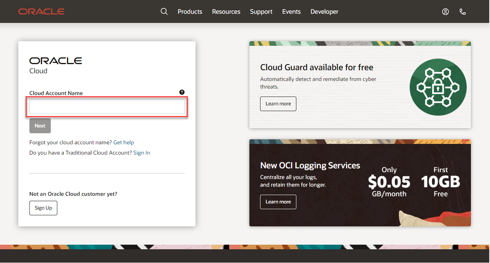
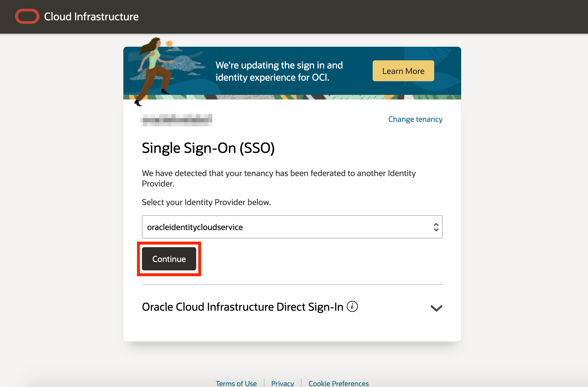
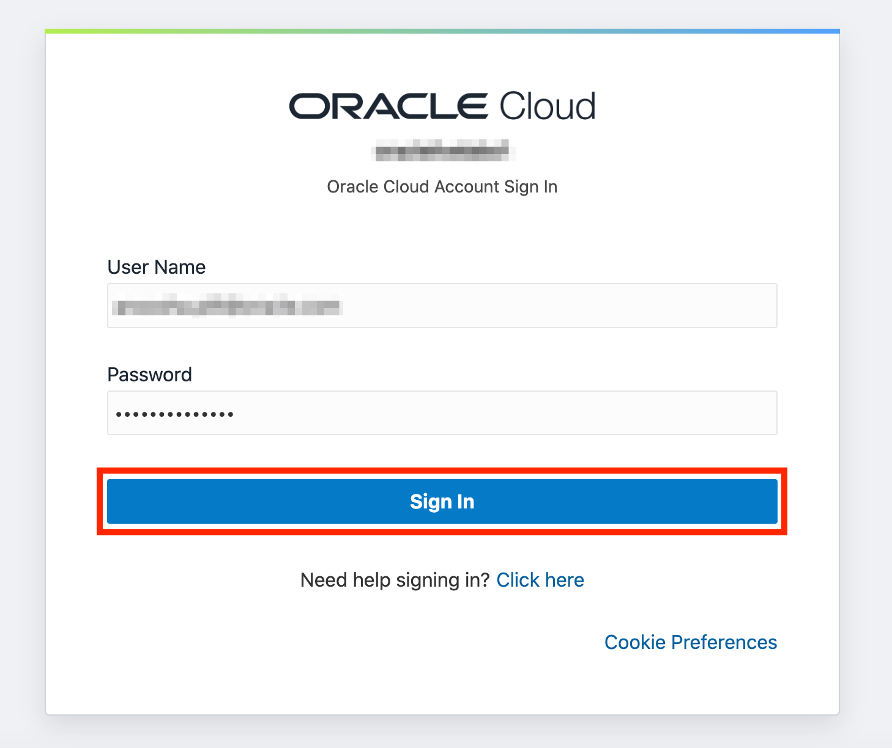

# Get started - Cloud login

## Introduction

Oracle Cloud is the industry's broadest and most integrated cloud provider, with deployment options ranging from the public cloud to your data center. Oracle Cloud offers best-in-class services across Software as a Service (SaaS), Platform as a Service (PaaS), and Infrastructure as a Service (IaaS). In this lab, we will be using the Oracle Cloud Infrastructure (OCI) Data Science service and running Jupyter notebooks to explore the MosaicML Composer library and train BERT models.

Estimated Time: 5 minutes

### Cloud Accounts for This Lab

For this lab, you have access to a pre-provisioned account hosted by MosaicML. Upon arrival at the workshop, you should have received an assigned account name from the MosaicML team. Please look up the credentials for your assigned name on [this spreadsheet](https://docs.google.com/spreadsheets/d/1fXxDErqZdfsaMZpyB7etDh3gUnFmpZsE3rKtW71bCeY/edit?usp=sharing)

### Objectives

- Learn how to login to your assigned Oracle Cloud Account for this lab

### Prerequisites
- Cloud Account Name: **mosaicmlprod**
- Username from the spreadsheet linked above
- Password from the spreadsheet linked above

## Task 1:  Login to Oracle Cloud
If you have an Oracle Cloud account already, and you've signed in with your personal credentials, please sign out and use these steps to sign back in.

1. Go to [cloud.oracle.com](https://cloud.oracle.com) and enter `mosaicmlprod` and click **Next**.

    

2. Click **Continue** to reveal the login input fields.

    

3. Enter your assigned Cloud Account credentials from [this spreadsheet](https://docs.google.com/spreadsheets/d/1fXxDErqZdfsaMZpyB7etDh3gUnFmpZsE3rKtW71bCeY/edit?usp=sharing) and click **Sign In**.

    

4. You are now signed in to Oracle Cloud!

    

You may now **proceed to the next lab**.

## Acknowledgements
- **Created By/Date** - Kay Malcolm, Database Product Management, Oracle, March 2020
- **Last Updated By** - Kobie Crawford, Head of Community, MosaicML, Oct 2022
